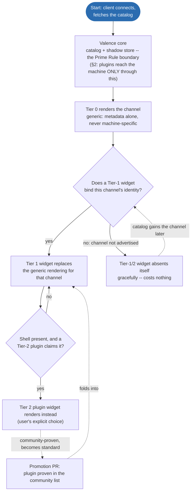

# Phosphor -- the reference Valence client & widget system

> Home of Phosphor's design rulings. Moved from the archived machine repo
> 2026-09-25; rulings predate the rename and stand.

Wire truth stays in the Valence repo (sibling checkout, pinned by
`valence.pin`); this document is everything above the wire -- the
client/widget architecture (`governance.md` C-1: this is that fact's one
home).

## 1. What Phosphor is

The first-party Valence client -- a Tauri 2 application whose UI core doubles
as a community framework -- plus the widget/plugin system that lets the
experience be upgraded per-capability without ever bloating the standard.

Goals, in priority order:
1. **Compatible with every Valence hub** -- any conformant hub gets a
   complete, correct, safe UI with zero Phosphor knowledge of the machine.
2. **Gold-standard full experience** for capabilities that have earned it
   (Kinetic planning, fray-d's Advanced pattern generator, the Nucleus
   telemetry set).
3. **User-controlled customization** -- widget upgrades are visible, optional,
   swappable, and user-installable.
4. **The standard grows by proof** -- community widgets earn promotion the way
   protocol changes earn RFC numbers.

## 2. The Prime Rule (operator ruling, 2026-07-27)

> **Plugins add features through Valence, not around it. If a plugin needs
> something that isn't part of Valence, that thing gets implemented -- in the
> protocol or the firmware -- at that point.**

Consequences, all deliberate:
- The plugin API surface IS the Valence model: the catalog, the shadow store
  (reported state in, intents out, pending -> echo-confirmed lifecycle), the
  event stream, and roles. No socket access, no side channels, no HTTP
  backdoors.
- Ground-truth doctrine (`.claude/rules/webui.md`) holds structurally: a
  plugin cannot lie about machine state because it never owns state -- it
  renders the shadow store and submits intents like everyone else.
- A plugin hitting a protocol gap is the discovery mechanism for the next
  RFC -- the client-side twin of the spec-gap ritual.

## 3. The three tiers

**Tier 0 -- generic catalog renderer (the floor).** Renders ANY advertised
channel from catalog metadata alone: layout fields -> readouts, schema keys ->
typed setting cards, options -> selects, `option_access` -> role gating, safety
exemptions honored. Never removed, never machine-specific. This tier is the
conformance claim "works with every hub" and is the client-side floor of the
Valence repo's `spec/RENDERING.md` derivation chain (catalog entry ->
category -> rank -> archetype -> widget pattern -> region -> page).

**Tier 1 -- standard widgets (the earned set).** Rich widgets that BIND TO
REGISTERED ROLES, not machines or raw channel ids -- a role (the registry's
`field_roles`, e.g. `window.min`) is ecosystem-wide and never renumbered, so
binding on role is machine-agnostic by construction, and survives a channel
being renumbered or reshaped. **As implemented, this is stronger than the
original channel-id proposal:** Phosphor's heroes (`src/ui/heroes.js`,
`claimRoles()` in `src/model/roles.js`) declare `require`/`optional` role
sets; a hero whose required roles are not all advertised declines silently
and its fields fall through to Tier 0. The standard grows widgets, never
requirements.

Founding set (operator-ratified 2026-07-27), current implementation:
| Widget | Binds to |
|---|---|
| Rail hero + telemetry chart | motion telemetry/window/command roles (`RailWidget.svelte`) + motion STATE channel (`TelemetryChart.svelte`) |
| Safety bar + anomaly log | safety STATE, motion-anomaly EVENT (`SafetyBar.svelte`, `LogPane.svelte`'s anomaly tab) |
| Plan strip | plan-strip channel (`PlanStrip.svelte`); Kinetic tuning itself still renders through the generic Tier-0 settings cards -- no dedicated tuning widget exists yet |
| fray-d Advanced generator panel | pattern role family (running/select/speed/depth/stroke/sensation) + preset store (`PatternWidget.svelte`) |

*(A Tier-1 binding is to a role or channel's registered IDENTITY, which
survives renumbering, not to a number restated here. The machine's own
channel-map doc has not been re-created since the Nucleus/P4 rebuild; it
lived at `docs/slopsync/CHANNEL-MAP.md` on the archived S3 machine.)*

Reading the diagram: the two decision diamonds are re-evaluated per channel,
not once per session -- a page with ten advertised channels walks this flow
ten times, independently, every catalog refresh. The dashed edges are the two
loops that close the system: a plugin earning its way into the standard
(bottom), and a channel that was absent showing up in a later firmware and
being picked up automatically (left).

## 4. The widget contract

A widget declares:
- `binds`: registered role(s) and/or channel id(s) it upgrades (`require` /
  `optional` in `heroes.js`'s registry);
- `renders`: the slot it fills -- realized in code as `zone: 'instrument' |
  'card'` (`heroes.js`): `instrument` is pinned chrome in the hero strip,
  `card` is an ordinary dashboard card the generic grid lays out and
  reorders. Tier 2 plugins compose into the same slots Tier 0 already builds
  instead of fighting it;
- what it receives: a scoped view of the shadow store for its channels/roles
  + the catalog entries it bound;
- what it may do: submit intents (queued through the core's pending->echo
  lifecycle), subscribe to events, persist per-widget user settings.

Trust model: plugins run as trusted code (community-review culture), but the
API is deliberately narrow enough -- store-scoped, no socket, no global DOM
contract -- that sandboxing can be added later without breaking conformant
plugins. Anything a plugin "needs" beyond this is a Prime Rule event (§2).

**Freeze discipline:** the moment the first external plugin exists, the
widget API is frozen the way Valence's `hub.hpp`/`client.hpp` are frozen
(governance C-6): additive evolution only, versioned, never breaking. Design
it small and boring. The v1 contract, with the freeze candidate marked,
is [PLUGINS.md](PLUGINS.md); the trigger is tracked on the board.

## 5. Compliance testing -- the sim modes

History: the sim's catalog was previously reduced/diverged from the device
specifically to exercise the UI's generic rendering. Ruling: that was the
wrong mechanism -- it left the primary test surface permanently degraded and
let the committed fixture drift from reality (dev board ruling, 2026-07-27).

The replacement -- **catalog profiles as a sim flag**:
- `--profile device` (DEFAULT): full device fidelity -- the complete Nucleus
  catalog incl. plan-strip, power, kinetic-diag, motion-anomaly, and
  `raw_10um`. What Phosphor develops against; what the committed fixture is
  captured from.
- `--profile alien`: a deliberately weird conformant hub -- unknown vendor
  channels, odd units, sparse metadata, missing niceties, hostile-but-legal
  catalog shapes. Tier 0 proves genericity here; Tier 1 proves graceful
  absence here.
- `--profile minimal`: the smallest conformant catalog -- the "any hub at
  all" floor.

Test mapping: fixture + Tier-1 tests <-> `device`; genericity/compliance
tests <-> `alien` + `minimal`.

**(planned)** These three profiles described the old `slopsim` harness.
`Nucleus/sim/valencesim`, its successor, is being ported now and does not
exist on disk yet as of this writing -- treat the profile flags and the
per-channel sim-coverage gap they used to document as unverified until the
port lands. Current state: the dev board (`bd`, prefix `ph-` here;
Nucleus's own board for the sim side).

> DEMO-CANDIDATE: `Nucleus/sim/valencesim --profile minimal` next to
> `--profile device`, same client, to show the "any hub at all" floor and the
> full reference machine side by side -- the portability claim made concrete.

## 6. Architecture notes

- **Verified against the current tree (2026-09-25):** there is no `core/`
  kernel directory. `src/model/` (the shadow store, connection, roles,
  settings) imports the protocol layer directly and live from the sibling
  checkout (`../Valence/clients/js/index.js` and friends) -- there is no
  local copy or package boundary between the two. The existing widgets
  (`src/ui/`, `src/ui/hero/`, `src/ui/widgets/`) are the Tier-1 exemplars.
- Tauri 2 shell owns: plugin discovery/loading ([PLUGINS.md](PLUGINS.md)),
  the community plugin list (planned), updates, multi-hub connections
  (SPEC §13.8 UDP discovery -- `src-tauri/src/discovery.rs` -- + manual host entry; **not
  mDNS**, corrected from the original SlopDeck-era text), and whatever the
  embedded-UI ruling (§8) leaves to it.
- The UI kernel stays publishable as the community "webui framework" project
  regardless of §8's outcome.

## 7. Sequencing

The ladder, description only -- status for each item lives on the dev board
(`bd`, prefix `ph-`), never restated here:

1. **Sim fidelity** -- `--profile device` at full catalog; fixture capture;
   `alien`/`minimal` profiles (§5).
2. **Widget interface extraction** -- formalize the contract from the
   founding widgets; Tier 0/1 split explicit in the codebase.
3. **Tauri 2 shell** -- shell ships (`src-tauri/`, vendored
   `tauri-plugin-blec` at `src-tauri/vendor/tauri-plugin-blec/`, Android
   target), plugin loader and two example Tier-2 plugins
   ([PLUGINS.md](PLUGINS.md)).
4. **API freeze + docs** -- widget contract documented, versioned, frozen;
   community plugin list opened.
5. Embedded-UI ruling (§8) executed wherever it lands.

## 8. RULED (operator, 2026-07-27) -- delivery vehicles

**Serving a UI is a hub capability, never a requirement** (Valence RFC-043).
One Svelte client kernel, three delivery vehicles, tiers orthogonal to
delivery:

- **Embedded (hubs with the capability):** a thin client exposing ALL
  controls at Tier 0+1 -- the machine-served page, zero-install from any
  browser on the LAN, doubles as the emergency surface (tokenless e-stop is
  role-exempt by design). SlopDrive-32 (archived, S3, 16 MB) shipped this
  first; Nucleus (P4) inherits the role.
- **Hosted (the universal path):** a canonical community-hosted instance of
  the same client, served over **plain http** (deliberate -- see landmine
  below), for hubs that cannot or should not serve assets. The
  underpowered-reference-hardware hub is the motivating first-class target:
  limited, mediocre, fully legitimate -- "just because you don't have the
  capability to host HTTP doesn't mean you should suffer."
- **Shell (Tauri 2, the premium tier):** same bundle in a native frame,
  buying back what browsers confiscate: UDP hub discovery (SPEC §13.8,
  `src-tauri/src/discovery.rs` -- no web page can ever do this), no
  mixed-content wall, Tier 2 plugin loading from disk, and non-WS transports
  (Valence over BLE GATT, presented to the shared session code as a
  WebSocket-shaped transport -- `src/shell/ble-ws.js`, RFC-043's hub-side
  twin).

**Recorded landmine -- PWA is NOT a delivery vehicle.** PWAs require https to
install, and an https origin cannot open `ws://` to a LAN hub
(mixed-content). Until/unless hubs speak wss (TLS on ESP32-class hardware =
cert pain, explicitly not planned), the browser story is the plain-http
hosted page and the embedded page -- both of which work everywhere, including
iOS Safari. Nobody promises a PWA. If browsers eventually strangle
plain-http pages, the Shell is the pre-built exit.

Reading the diagram: the dashed edge into Shell says it is reachable
independent of the embedded/hosted decision -- any hub, WS or BLE, can be
opened directly from the Shell without going through a web page first. The
dashed edge into PWA is the recorded dead end: not a delivery path, a
landmine to not step on.

**The delivery accord (operator-blessed, 2026-07-27):** one Svelte kernel,
shipped two ways. The Phosphor app (Tauri; Android APK -- confirmed live in
this tree, `src-tauri/tauri.conf.json`'s `android` block + `src-tauri/icons/
android/` -- plus desktop installers; Play Store bans adult apps,
distribution is direct) is the canonical, feature-complete client:
BLE+WS, UDP discovery, Tier 2 plugins (planned), mobile-first per the
audience map (mainstream = mobile app; power users = desktop + MFP;
Intiface/VR = desktop streamer + mobile/hardware remote; owners of
underpowered reference hardware = the audience Valence exists to serve). The
embedded/hosted page is the same bundle built WS-only at Tier 0+1 -- served
from capable hubs' flash and from one community URL; it is the zero-install
onramp, guest/iOS surface, and emergency stop. The faces cross-promote (page
-> QR -> app). Divergence between targets is build configuration, never
code. The bar: discovery just works, the mobile app just works -- and if an
iOS store listing ever becomes possible, it just works too (the Tauri iOS
target stays buildable; no promises on Apple).

**Transport doctrine (same ruling):** Valence is the only protocol that
matters and is transport-agnostic (Valence SPEC.md §13); every hub SHOULD
expose both WS and BLE GATT on ESP32-class hardware. The legacy OSSM BLE
masquerade is EOL -- Valence-over-BLE replaces it, and Phosphor's Shell is
what speaks it client-side (browsers can't, portably). See
`../Nucleus/.claude/rules/transport.md` (transport doctrine) + Valence
RFC-043.

## 9. Framework ruling -- Svelte 5, with one piece of insurance

Svelte 5 is confirmed as the kernel framework (operator + agent concurrence,
2026-07-27). Rationale: the framework compiles away -- smallest runtime of
the mainstream options, which the flash-budgeted embedded build hard-requires;
fine-grained rune reactivity fits high-rate telemetry (25-60 Hz updates
without VDOM diffing); the existing catalog-driven client is already Svelte 5
and proven. React fails the embedded budget and the update model; Solid would
be a lateral move not worth a rewrite; Lit/web-components would tax Tier-1
widget DX.

**The insurance (binding on the Tier-2 API):** plugins are NOT Svelte
components. The plugin ABI is framework-neutral -- a plugin exports
`mount(slotEl, api)` / `unmount()` and ships self-contained; the kernel
treats it as a black box in its slot. This is what makes the C-6-style API
freeze survivable: Phosphor can upgrade Svelte majors without breaking one
plugin, and plugin authors can use any framework or none. Svelte's internals
never become public API. Realized as `activate(api)` plus a hero's
`mount(el, fields)` returning `{update, unmount}`, the api reaching the
mount by closure; see [PLUGINS.md](PLUGINS.md).

> DEMO-CANDIDATE: a minimal vanilla-JS plugin (`mount`/`unmount`, no
> framework at all) rendering one live-updating card, to prove the ABI
> insurance concretely -- no Svelte required to build a Tier-2 widget.
