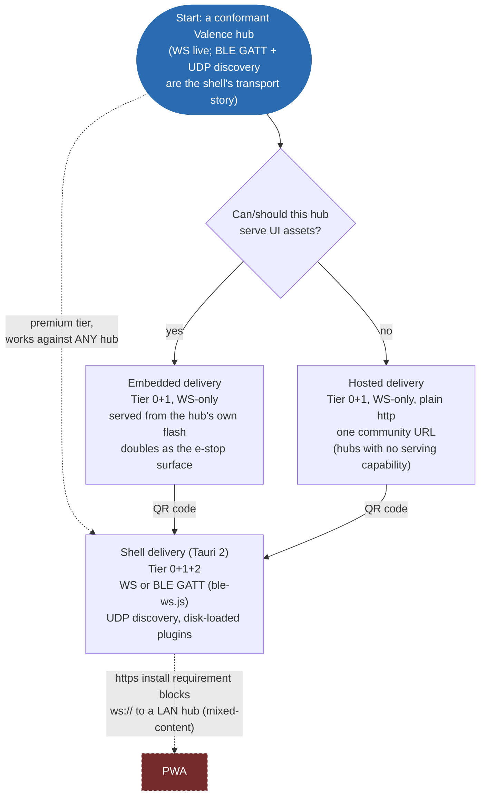

# Phosphor -- the reference Valence client & widget system

> Home of Phosphor's design rulings; rulings that predate the 2026-09-21
> rename stand. The predecessor firmware is frozen and never cited: no file
> here names it, and a pointer to what exists now replaces any citation of it
> (Nucleus `.claude/rules/governance.md` §6, amendment 2026-10-03).

Wire truth stays in the Valence repo (sibling checkout, pinned by
`valence.pin`); this document is everything above the wire -- the
client/widget architecture (`governance.md` C-1: this is that fact's one
home).

## 1. What Phosphor is

The first-party Valence client -- a Tauri 2 application whose UI core doubles
as a community framework -- plus the widget/plugin system that lets the
experience be upgraded per-capability without ever bloating the standard.

Goals, in priority order:
1. **Compatible with every Valence hub** -- any conformant hub gets a
   complete, correct, safe UI with zero Phosphor knowledge of the machine.
2. **Gold-standard full experience** for capabilities that have earned it
   (Kinetic planning, fray-d's Advanced pattern generator, the Nucleus
   telemetry set).
3. **User-controlled customization** -- widget upgrades are visible, optional,
   swappable, and user-installable.
4. **The standard grows by proof** -- community widgets earn promotion the way
   protocol changes earn RFC numbers.

## 2. The Prime Rule (operator ruling, 2026-07-27)

> **Plugins add features through Valence, not around it. If a plugin needs
> something that isn't part of Valence, that thing gets implemented -- in the
> protocol or the firmware -- at that point.**

Consequences, all deliberate:
- The plugin API surface IS the Valence model: the catalog, the shadow store
  (reported state in, intents out, pending -> echo-confirmed lifecycle), the
  event stream, and roles. No socket access, no side channels, no HTTP
  backdoors.
- Ground-truth doctrine (`.claude/rules/webui.md`) holds structurally: a
  plugin cannot lie about machine state because it never owns state -- it
  renders the shadow store and submits intents like everyone else.
- A plugin hitting a protocol gap is the discovery mechanism for the next
  RFC -- the client-side twin of the spec-gap ritual.

## 3. The three tiers

**Tier 0 -- generic catalog renderer (the floor).** Renders ANY advertised
channel from catalog metadata alone: layout fields -> readouts, schema keys ->
typed setting cards, options -> selects, `option_access` -> role gating, safety
exemptions honored. Never removed, never machine-specific. This tier is the
conformance claim "works with every hub" and is the client-side floor of the
Valence repo's `spec/RENDERING.md` derivation chain (catalog entry ->
category -> rank -> archetype -> widget pattern -> region -> page).

**Tier 1 -- standard widgets (the earned set).** Rich widgets that BIND TO
REGISTERED ROLES, not machines or raw channel ids -- a role (the registry's
`field_roles`, e.g. `window.min`) is ecosystem-wide and never renumbered, so
binding on role is machine-agnostic by construction, and survives a channel
being renumbered or reshaped. **As implemented, this is stronger than the
original channel-id proposal:** Phosphor's heroes (`src/ui/heroes.js`,
`claimRoles()` in `src/model/roles.js`) declare `require`/`optional` role
sets; a hero whose required roles are not all advertised declines silently
and its fields fall through to Tier 0. The standard grows widgets, never
requirements.

Founding set (operator-ratified 2026-07-27), current implementation:
| Widget | Binds to |
|---|---|
| Rail hero + telemetry chart | motion telemetry/window/command roles (`RailWidget.svelte`) + motion STATE channel (`TelemetryChart.svelte`) |
| Safety bar + anomaly log | safety STATE, motion-anomaly EVENT (`TopStrip.svelte`, `LogPane.svelte`'s anomaly tab) |
| Plan strip | plan-strip channel (`PlanStrip.svelte`); Kinetic tuning itself still renders through the generic Tier-0 settings cards -- no dedicated tuning widget exists yet |
| fray-d Advanced generator panel | pattern role family (running/select/speed/depth/stroke/sensation) + preset store (`PatternWidget.svelte`) |

*(A Tier-1 binding is to a role or channel's registered IDENTITY, which
survives renumbering, not to a number restated here. The machine's own
channel allocation is the `ch::` namespace in Nucleus
`flagship_p4/src/hub/ValenceCatalog.h`.)*

Reading the diagram: the two decision diamonds are re-evaluated per channel,
not once per session -- a page with ten advertised channels walks this flow
ten times, independently, every catalog refresh. The dashed edges are the two
loops that close the system: a plugin earning its way into the standard
(bottom), and a channel that was absent showing up in a later firmware and
being picked up automatically (left).

## 4. The widget contract

A widget declares:
- `binds`: registered role(s) and/or channel id(s) it upgrades (`require` /
  `optional` in `heroes.js`'s registry);
- `renders`: the slot it fills -- realized in code as `zone: 'instrument' |
  'card'` (`heroes.js`): `instrument` is pinned chrome in the hero strip,
  `card` is an ordinary dashboard card the generic grid lays out and
  reorders. Tier 2 plugins compose into the same slots Tier 0 already builds
  instead of fighting it;
  *(Superseded 2026-09-26 by §10.2: every widget, plugin widgets included, is a
  placeable control on the builder grid. The two zones describe today's code
  until phase (c) lands.)*
- what it receives: a scoped view of the shadow store for its channels/roles
  + the catalog entries it bound;
- what it may do: submit intents (queued through the core's pending->echo
  lifecycle), subscribe to events, persist per-widget user settings.

Trust model: plugins run as trusted code (community-review culture), but the
API is deliberately narrow enough -- store-scoped, no socket, no global DOM
contract -- that sandboxing can be added later without breaking conformant
plugins. Anything a plugin "needs" beyond this is a Prime Rule event (§2).

**Freeze discipline:** the moment the first external plugin exists, the
widget API is frozen the way Valence's `hub.hpp`/`client.hpp` are frozen
(governance C-6): additive evolution only, versioned, never breaking. Design
it small and boring. The v1 contract, with the freeze candidate marked,
is [PLUGINS.md](PLUGINS.md); the trigger is tracked on the board.
*(Re-timed 2026-09-26: the freeze also waits for the builder's control
contract, §10.2, because plugin widgets change shape under it.)*

## 5. Compliance testing -- the sim modes

History: the sim's catalog was previously reduced/diverged from the device
specifically to exercise the UI's generic rendering. Ruling: that was the
wrong mechanism -- it left the primary test surface permanently degraded and
let the committed fixture drift from reality (dev board ruling, 2026-07-27).

The replacement -- **catalog profiles as a sim flag**:
- `--profile device` (DEFAULT): full device fidelity -- the complete Nucleus
  catalog incl. plan-strip, power, kinetic-diag, motion-anomaly, and
  `raw_10um`. What Phosphor develops against; what the committed fixture is
  captured from.
- `--profile alien`: a deliberately weird conformant hub -- unknown vendor
  channels, odd units, sparse metadata, missing niceties, hostile-but-legal
  catalog shapes. Tier 0 proves genericity here; Tier 1 proves graceful
  absence here.
- `--profile minimal`: the smallest conformant catalog -- the "any hub at
  all" floor.

Test mapping: fixture + Tier-1 tests <-> `device`; genericity/compliance
tests <-> `alien` + `minimal`.

**(planned)** `Nucleus/sim/valencesim` has no `--profile` flag yet
[verified 2026-10-03 -- `git grep -- --profile sim` in Nucleus is empty];
treat the profile flags and the per-channel sim-coverage gap as unverified
until it does. Current state: the dev board (`bd`, prefix `ph-` here;
Nucleus's own board for the sim side).

> DEMO-CANDIDATE: `Nucleus/sim/valencesim --profile minimal` next to
> `--profile device`, same client, to show the "any hub at all" floor and the
> full reference machine side by side -- the portability claim made concrete.

## 6. Architecture notes

- **Verified against the current tree (2026-09-25):** there is no `core/`
  kernel directory. `src/model/` (the shadow store, connection, roles,
  settings) imports the protocol layer directly and live from the sibling
  checkout (`../Valence/clients/js/index.js` and friends) -- there is no
  local copy or package boundary between the two. The existing widgets
  (`src/ui/`, `src/ui/hero/`, `src/ui/widgets/`) are the Tier-1 exemplars.
- Tauri 2 shell owns: plugin discovery/loading ([PLUGINS.md](PLUGINS.md)),
  the community plugin list (planned), updates, multi-hub connections
  (SPEC §13.8 UDP discovery -- `src-tauri/src/discovery.rs` -- + manual host entry; **not
  mDNS**), and whatever the
  embedded-UI ruling (§8) leaves to it.
- **Hubs pane Scan: UDP discovery first, Bluetooth fallback** (operator
  ruling 2026-10-02 on RFC-046; no mDNS, RFC-072 ruling 2026-10-01). The
  §13.8 probe lists every reply; only an empty LAN result runs the BLE scan.
  One row per hub, marked `LAN` or `BLE`; a hub found both ways is one row
  keyed by `hub_instance_id`, connecting over LAN. Restated 2026-10-03:
  "Bluetooth as an in-UI backup and a second scan after LAN fails." Scan
  runs the 1.5 s LAN probe, then on no reply the BLE scan, appending its
  rows; Scan Bluetooth stays as the manual backup for a config-mode hub
  (BLE only, SPEC §13.4.1) beside a WiFi hub. The launch probe is LAN only.
- The UI kernel stays publishable as the community "webui framework" project
  regardless of §8's outcome.

## 7. Sequencing

The ladder, description only -- status for each item lives on the dev board
(`bd`, prefix `ph-`), never restated here:

1. **Sim fidelity** -- `--profile device` at full catalog; fixture capture;
   `alien`/`minimal` profiles (§5).
2. **Widget interface extraction** -- formalize the contract from the
   founding widgets; Tier 0/1 split explicit in the codebase.
3. **Tauri 2 shell** -- shell ships (`src-tauri/`, vendored
   `tauri-plugin-blec` at `src-tauri/vendor/tauri-plugin-blec/`, Android
   target), plugin loader and two example Tier-2 plugins
   ([PLUGINS.md](PLUGINS.md)).
4. **API freeze + docs** -- widget contract documented, versioned, frozen;
   community plugin list opened. *(Re-timed 2026-09-26: after the builder's
   control contract, §10.2.)*
5. Embedded-UI ruling (§8) executed wherever it lands.

## 8. RULED (operator, 2026-07-27) -- delivery vehicles

**Serving a UI is a hub capability, never a requirement** (Valence RFC-043).
One Svelte client kernel, three delivery vehicles, tiers orthogonal to
delivery:

- **Embedded (hubs with the capability):** a thin client exposing ALL
  controls at Tier 0+1 -- the machine-served page, zero-install from any
  browser on the LAN, doubles as the emergency surface (tokenless e-stop is
  role-exempt by design). Nucleus (P4) carries the role.
  *(Amended 2026-09-26, §10.7: the hub-served page is the BACKUP delivery;
  parity with the shell may break. "ALL controls" now means every field
  stays reachable per RENDERING §12, not that every shell feature ships.)*
- **Hosted (the universal path):** a canonical community-hosted instance of
  the same client, served over **plain http** (deliberate -- see landmine
  below), for hubs that cannot or should not serve assets. The
  underpowered-reference-hardware hub is the motivating first-class target:
  limited, mediocre, fully legitimate -- "just because you don't have the
  capability to host HTTP doesn't mean you should suffer."
- **Shell (Tauri 2, the premium tier):** same bundle in a native frame,
  buying back what browsers confiscate: UDP hub discovery (SPEC §13.8,
  `src-tauri/src/discovery.rs` -- no web page can ever do this), no
  mixed-content wall, Tier 2 plugin loading from disk, and non-WS transports
  (Valence over BLE GATT, presented to the shared session code as a
  WebSocket-shaped transport -- `src/shell/ble-ws.js`, RFC-043's hub-side
  twin).

**Recorded landmine -- PWA is NOT a delivery vehicle.** PWAs require https to
install, and an https origin cannot open `ws://` to a LAN hub
(mixed-content). Until/unless hubs speak wss (TLS on ESP32-class hardware =
cert pain, explicitly not planned), the browser story is the plain-http
hosted page and the embedded page -- both of which work everywhere, including
iOS Safari. Nobody promises a PWA. If browsers eventually strangle
plain-http pages, the Shell is the pre-built exit.

Reading the diagram: the dashed edge into Shell says it is reachable
independent of the embedded/hosted decision -- any hub, WS or BLE, can be
opened directly from the Shell without going through a web page first. The
dashed edge into PWA is the recorded dead end: not a delivery path, a
landmine to not step on.

**The delivery accord (operator-blessed, 2026-07-27):** one Svelte kernel,
shipped two ways. The Phosphor app (Tauri; Android APK -- confirmed live in
this tree, `src-tauri/tauri.conf.json`'s `android` block + `src-tauri/icons/
android/` -- plus desktop installers; Play Store bans adult apps,
distribution is direct) is the canonical, feature-complete client:
BLE+WS, UDP discovery, Tier 2 plugins (planned), mobile-first per the
audience map (mainstream = mobile app; power users = desktop + MFP;
Intiface/VR = desktop streamer + mobile/hardware remote; owners of
underpowered reference hardware = the audience Valence exists to serve). The
embedded/hosted page is the same bundle built WS-only at Tier 0+1 -- served
from capable hubs' flash and from one community URL; it is the zero-install
onramp, guest/iOS surface, and emergency stop. The faces cross-promote (page
-> QR -> app). Divergence between targets is build configuration, never
code. The bar: discovery just works, the mobile app just works -- and if an
iOS store listing ever becomes possible, it just works too (the Tauri iOS
target stays buildable; no promises on Apple).
*(Amended 2026-09-26, §10.7: "divergence is build configuration, never code"
no longer binds where the served page lacks the host capability: window
chrome, the builder, the embedded buttplug server and plugins may be shell
code. "Mobile-first" is under review while the mobile layout is unresolved,
§10.9.)*

**Transport doctrine (same ruling):** Valence is the only protocol that
matters and is transport-agnostic (Valence SPEC.md §13); every hub SHOULD
expose both WS and BLE GATT on ESP32-class hardware. The legacy OSSM BLE
masquerade is EOL -- Valence-over-BLE replaces it, and Phosphor's Shell is
what speaks it client-side (browsers can't, portably). See
`../Nucleus/.claude/rules/transport.md` (transport doctrine) + Valence
RFC-043.

## 9. Framework ruling -- Svelte 5, with one piece of insurance

Svelte 5 is confirmed as the kernel framework (operator + agent concurrence,
2026-07-27). Rationale: the framework compiles away -- smallest runtime of
the mainstream options, which the flash-budgeted embedded build hard-requires;
fine-grained rune reactivity fits high-rate telemetry (25-60 Hz updates
without VDOM diffing); the existing catalog-driven client is already Svelte 5
and proven. React fails the embedded budget and the update model; Solid would
be a lateral move not worth a rewrite; Lit/web-components would tax Tier-1
widget DX.

**The insurance (binding on the Tier-2 API):** plugins are NOT Svelte
components. The plugin ABI is framework-neutral -- a plugin exports
`mount(slotEl, api)` / `unmount()` and ships self-contained; the kernel
treats it as a black box in its slot. This is what makes the C-6-style API
freeze survivable: Phosphor can upgrade Svelte majors without breaking one
plugin, and plugin authors can use any framework or none. Svelte's internals
never become public API. Realized as `activate(api)` plus a hero's
`mount(el, fields)` returning `{update, unmount}`, the api reaching the
mount by closure; see [PLUGINS.md](PLUGINS.md).

> DEMO-CANDIDATE: a minimal vanilla-JS plugin (`mount`/`unmount`, no
> framework at all) rendering one live-updating card, to prove the ABI
> insurance concretely -- no Svelte required to build a Tier-2 widget.

## 10. The builder (operator rulings 2026-09-26)

Phosphor is a UI builder. Valence is the framework behind it, optimized for
embedded controllers. The phased plan is epic `ph-e82`; status lives there,
never here (C-2). The phases landed on 2026-10-01 in these commits:

- (a) top strip, full width: `72203c4`.
- (b) grid, scale, named layouts: `e25b83c`.
- (c) control contract: `64796b7`; per-placement look (§10.2): `204480e`.
- (d) home page: `72f0b6a`.
- (e) nests and modules: `3af57d2`.
- (f) is the mobile ruling (`ph-e82.7`, §10.9), not code; nothing landed.
- (g) buttplug embed: `5e8d81d` (server pane), `5976718` (server and
  machine), `53fadf3` (toys as modules), `ee49622` (stop all toys),
  `185bc64` (per-device toy stop).

Rulings still owed are marked OPEN below (`ph-e82.7`; the relationship
question in §10.8).

### 10.1 The Dash (the home page) replaces Overview

- The home page, named **Dash** in the sidebar, the F3 index and the copy
  (§10.11), is a user-arranged grid. It replaces the Overview tab
  (`src/App.svelte`: the `machine` tab and `machineItems`).
- Everything that lived only on Overview becomes a module or is deleted with
  C-9 proof: hero-rank leftovers, telemetry, card-zone heroes, loose actions.
- The derived category pages stay. Every field remains reachable without the
  home page (RENDERING §12: classes differ in projection, never in reachable
  content). The home is an additional surface, never the only path to a
  field.
- A home the user has not built is seeded from rank (RENDERING §4, hero
  surfaced; `ph-vdk.36`) plus the migrated layout of §10.6.
- Edit mode places, moves, resizes and deletes from a palette of every
  placeable control. Outside edit mode nothing drags (`DashItem.svelte`: the
  grab handle is the only draggable surface).
- Rests on RENDERING §12 and law 10. CLOSED (operator ruling 2026-09-26,
  `ph-e82.1` item 1): saved layouts, including the home page, are NOT the
  catalog-built UI (§10.2). The catalog-built UI stays and earns its keep on
  hardware remote controls and embedded processors with screens and buttons;
  every field stays reachable through it regardless of any saved layout. The
  home is additional, never a replacement, which is what keeps §11 ("pages
  are derived, never designed per app") and §9 ("region assignment is never a
  per-app choice") true of the derived tree. Confirmed as coded (operator
  ruling 2026-10-01).
- As coded (`72f0b6a`): card-zone heroes (pattern, limits, plugin heroes)
  are home modules AND cards at the top of the category page their claimed
  fields came from (the `other` page when none is categorized); loose
  actions are a home module AND join the `other` overflow page (RENDERING
  §3), so nothing Overview showed is reachable only from the home. Home
  membership is the key set of the active layout's `<class>.machine`
  placement map plus every nest's members; a map with no plain key shows
  the seed. The view id stays `machine`, the id the migrated Default layout
  already holds. Telemetry is a home module only: it is not a field, and its
  lanes' fields are reachable elsewhere.

### 10.2 The control contract

- A CONTROL is one catalog field plus one presentation. The ARCHETYPE is
  picked by the catalog (RENDERING §8.2) and is NOT user-editable. Within it
  the user picks a presentation by READ/WRITE CLASS (operator ruling
  2026-09-26): any writable field may take any writable presentation (knob,
  slider, stepper, segmented, toggle, and so on); any read-only field may
  take any read-only presentation (number, bar, bulb, graph, hero numeral). A
  writable field may ALSO be placed as a read-only presentation, a
  display-only instance: the set speed inside a pattern shown as a hero
  numeral rather than a small control, for example.
- The offered set comes from the field's archetype (RENDERING §8.2, §8.4) and
  its facts: bar needs bounds, toggle and bulb need a bool, graph needs a
  client-side history (gaps, never zeros: law 9). The user chooses how a
  field looks, never what it binds to (laws 6, 7).
- Range presentations (knob, slider, stepper, bar) take PER-PLACEMENT min,
  max, step, default (operator ruling 2026-09-26). A placement may NARROW the
  catalog's bounds, never widen them; the default must lie inside the
  narrowed range. This narrowing rule is the orchestrator's reading of Ground
  Truth (law 4) and law 7: a placement never claims more range than the
  field's own essential binding supports, and it never hides a live value
  that falls outside the narrowed display window.
- A toggle placement is configured as two discrete values, each an ordinary
  echo-confirmed write (law 4). A momentary override-and-return mode was
  considered and WITHDRAWN (operator ruling 2026-09-26): a client-side
  restore that depends on the client surviving the press runs against the
  Valence principle that policy lives on the hub, and it does not earn its
  place. If a hold-to-run ever matters (an accessory pump held on), it is a
  hub-side write that reverts unless refreshed, and it rides an RFC.
- Seam: `src/model/settings.js` (`resolveArchetype`, `resolveWidget`,
  `WIDGET`, whose `segmented`/`bitfield`/`secret` already are presentations
  inside one archetype) and `src/ui/Field.svelte`.
- Every presentation keeps the universal contract: the four-state ladder with
  a text reason (law 5), graying with the gate named (law 3), stale dimming
  (law 8). An echo pair travels as one control and a tagged min/max pair is
  one range control (RENDERING §11; `mergeRangePairs` in `settings.js`).
- CLOSED (operator ruling 2026-09-26, `ph-e82.1`): resolved by the
  read/write-class rule above, not by §8.2's first-match row. Slider vs
  stepper and readout vs graph are both presentations inside one read/write
  class; the archetype §8.2 assigns is a catalog fact the user never edits.
- Role-claiming composites are controls: rail hero, plan strip (nested in
  the rail per RENDERING §10 `plan-view`), pattern panel, limits. They place,
  resize and save like any control. Claim-or-decline is unchanged
  (`claimAll`, `src/model/roles.js`; law 7).
- Plugin widgets use the same contract. `registerHero`'s card-only zone
  (`src/plugins/host.js`) is superseded; §4's `renders` zones describe today's
  code only. The plugin API freeze (`ph-vdk.30`, §4) waits for this contract.
- Persisted keys are stable ids (law 10): a role when the field has one,
  else its uid; composites as `hero:<id>`. An id the catalog lacks stays
  inert in storage (`src/model/grid.js`). A uid is channel id plus field
  name, which law 10 calls wire vocabulary; the Valence RFC-080 draft
  ("User-authored surfaces and presentation choice", item 6) carries the
  carve-out: the uid key is allowed for USER-AUTHORED SURFACES ONLY, never
  for the conformant derived baseline. RULED (operator, 2026-10-01,
  `ph-e82.1` item 3): uid keys stand as coded, `uid:<channel>:<field>` for
  a field with no role, inert when absent, never rebound. A role field's
  uid-form key (written by builds before `ph-e82.9`) resolves to the same
  control as its role key. Codes against the draft by ruling, as below.
- RULED (operator, 2026-10-01, `ph-e82.1` items 2 and 4): design as though
  RFC-080 is accepted.
  - `CROSS_ARCHETYPE` is true (`src/model/settings.js`): the palette offers
    the read/write-class set above, display-only instances included.
  - Per-placement narrowing (RFC-080 item 4) and two-valued toggles (item 5)
    are coded. A placement entry in the layout store carries an optional
    `look` {pres, min, max, step, default, a, b} beside {x, y, w, h}
    (`src/model/grid.js` `setLook`; the home's edit mode sets it,
    `src/ui/LookEditor.svelte`). An entry without `look` is valid and means
    the derived presentation on the catalog's bounds, so no saved layout
    migrates. `settings.js` `placementLook` is the one rule: narrow, never
    widen; a step is a whole multiple of the catalog step; the default lies
    inside the placement's range; a toggle's two values differ and lie inside
    the field's range (a bool, two or more options, or bounds); a refused part
    keeps the catalog's value and is named in words. A reported value outside
    a narrowed range is shown as it is and marked, never pinned (law 4).
  - Single fields: RFC-080 leaves placement open (its open question 3), so
    fields stay placeable anywhere (`FIELDS_NESTS_ONLY` false in `grid.js`).
  - C-5 flag, recorded: this codes against a DRAFT RFC (RFC-080, ruling
    pending as `rfc-94c`), against the never-code-against-an-unaccepted-clause
    rule, by operator ruling. If RFC-080 is rejected or amended, the builder
    follows it.

### 10.3 The top strip: safety and window chrome

- All safety controls live at the TOP. The bottom edge sits against the
  Windows taskbar, where a missed click is jarring; at the top there is
  nothing to hit by accident. Supersedes the bottom dock; the strip is
  `src/ui/TopStrip.svelte`.
- NON-NEGOTIABLE: the top strip always carries the e-stop and pause controls
  the user cannot remove (RENDERING law 1, RFC-085). Each is ONE control with
  two states (law 14; `src/ui/widgets/SafetyOp.svelte`): pause/resume, and
  estop/release, where release is the same control held 3 s and the latched
  state reads Halted. The e-stop reads E-Stop only on a hub whose WELCOME
  declares `estop_cuts_power` true, else Halt (law 15). Bound by safety-op
  identity (law 2), never scrolled or hidden (laws 1, 11; RENDERING §9
  `persistent`). No separate clear, release or resume button exists anywhere.
- Each strip pair is also a placeable module (`safety:estop`,
  `safety:pause`). A second e-stop on the grid is fine; the strip's copy is
  the one that cannot go. Override/return is not a module: it is the rail's
  (SPEC §11.1).
- In the shell, every e-stop press also broadcasts the RFC-053 ESTOP datagram
  (the SPEC §5.5 frame) on every IPv4 interface to the §13.8 port: beside the
  session's own estop, never instead of it, over the whole §11.2 repeat
  budget, since a datagram's sender cannot see the latch. Opt-out, default on
  (RFC-053 item 3; Settings > Connection). Every hub on the segment that
  honors RFC-053 latches, not only the connected one; a Virtual Valence
  session never broadcasts, the built-in machine included. A press needs a live link to reach the hook,
  because the strip disables the e-stop without one. Seams:
  `noteEstopPress` (`src/model/actions.js`, runAction's first call),
  `src/shell/estop-udp.js`, `src-tauri/src/estop_udp.rs` (`ph-y4er`).
- Order, operator ruling 2026-10-02 (`ph-e82.21`): the e-stop is outermost
  at the far right, then Pause, Override, Flip and Home inward. Flip (SPEC
  §9.6) rides the strip beside Override, not the rail row, so the jog tape
  spans the rail edge for edge.
- The hero's target numeral takes a typed jog (operator ruling 2026-10-03,
  `ph-9kjh`, styling reverted by `ph-akeq`): it looks like the plain intent
  numeral, a hidden feature with no recess or border, a click or Enter
  opens an entry in place, and Enter sends the rail tape's own move,
  clamped to the tape's domain with "clamped to window" in the status slot,
  disabled with the tape's reason wherever the tape is; the big numeral
  stays reality. The planned target, lag and speed stack in one column
  beside it, in that order, each row "label value unit" on one line (operator
  ruling 2026-10-03, `ph-pmor`): it never grows the strip and is hidden only
  on a handheld stacked strip.
- The rail row is the track alone (operator ruling 2026-10-03, `ph-ryi7`):
  no mode words and no range text (the window's own label says the range,
  and its tooltip carries the window's description); a jog reason replaces
  TAP · SCRUB inside the tape; the panel's inset is one value on all four
  sides. While a generator owns the rail (`railOwned`) the slot shows the
  planned segment at the window's width: a reality-to-intent gradient from
  the planned position to the planned target, at the rail's own render
  instant, the marker amber while `plan.flags` names a bent plan (RFC-100; the readback's tooltip says which: shaped, stretched, fallback, clamped), else while the plan is stalled or past its
  duration. A control-owner slot held by another session keeps the
  full-width plan strip. The plan readback (owner, style, velocity, timing)
  rides the strip on the primary label's line, right of the numerals, while
  a source plays or a plan streams; stacked, a status condition outranks it.
  Seams: `src/ui/hero/RailWidget.svelte`, `src/ui/widgets/PlanStrip.svelte`,
  `src/ui/TopStrip.svelte`.
- The hero bar (operator rulings 2026-10-05): the rail joins the strip as
  one surface, the panel's line carried over as a divider between the
  numerals row and the rail; no panel outline. The jog tape is always
  shown wherever a jog is possible; while a source owns the rail the
  planned segment keeps its slot (`ph-ryi7`) and Override brings it back.
  The window's span (mm) is a small pill on a dark plate inside the
  band; its start and end values sit on the axis row under the band's
  edges, in the window color, beside the gray axis marks; no label row
  above the band. A small up-arrow tab mid-bar, between the readouts and the
  controls, hides the rail entirely; while hidden a 64 px live mini rail
  (the window and the live position, the rail's look, display only, never
  jog input) sits beside the tab, and tapping either shows the rail. The
  hidden state persists; Settings can turn the hide off. In buckets 1 and 2
  (§10.12) the mini is the rail's permanent form, and tapping it opens the
  rail rotated VERTICAL (travel top to bottom, tape and band with it) in a
  pop-up, dismissed by a tap outside, held open while a scrub or window drag
  is in progress. The bar keeps a height budget per bucket (§10.12).
- Strip buttons (operator rulings 2026-10-02 and 2026-10-05, `ph-9zdy`):
  Home, Flip, Override, Pause and Halt are one box, icon above the word,
  icons taller. An icon shows what the press does: Override is two arrows
  inside a window pointing out (lift the window), and once lifted two arrows
  outside pointing in (return); Flip is two arrows around a struck-through
  0, one pointing right and one grey pointing left.
- Home is one control; any other home op (Force Home, where the hub offers
  it) lives in its popover, and the status slot carries no remedy button.
  While home is required (the snapshot's `home_required`, or a `NOT_HOMED`
  refusal until a home op echoes) Home pulses a `--bad` border. AMENDMENT to
  law 13's reading here, same ruling: red marks the e-stop AND this one
  safety-adjacent required act, nothing else; static under reduced motion.
- The global refusal surface and the unattended chip (RENDERING §10.1 rule 3)
  stay in the strip, because it is the one surface always on screen.
- Phosphor replaces the OS title bar with its own decorations, and the shell
  bar merges into the strip. Seams: `src-tauri/tauri.conf.json` (window
  decorations), `src-tauri/capabilities/default.json` (window permissions),
  `src/shell/ShellStrip.svelte`. Windows first; Android has no frame; the
  served page draws the strip without window controls.
- One strip, one top reserve, one safe-area owner (`.claude/rules/webui.md`
  T22). Safety colors stay unthemeable in the new chrome (law 13).
- No shifting from non-user input (operator ruling 2026-10-02, amended
  2026-10-05). A link drop, a refusal, a reason, a notice or any other state
  never moves a control: every transient has a fixed slot reserved up front,
  and a long text ellipsizes with its full form in `title`. A user's own act
  (the rail's hide tab, the sidebar collapse, a disclosure, a window resize)
  may change heights, because it cannot cause a misinput elsewhere.
- The page footer (operator ruling 2026-10-02, `ph-vdk.60.12`;
  `src/ui/PageFoot.svelte`): one fixed 48 px bar at the bottom of the page
  area on every page with page controls (the advanced and diagnostic
  toggles, Reset, the in-flight count, Fullscreen), never scrolled, the
  scroll ending above it; a page with none has no footer. It owns the
  bottom safe-area inset. The UI scale is not in it (operator ruling
  2026-10-03, `ph-5q67`): it is the right end of the shell's bottom status
  row (`src/ui/ScaleControl.svelte` in `FootStrip`), compact, on every page.
  That row is one line at every width (operator ruling 2026-10-03,
  `ph-wt7r`): each value holds a fixed slot and a compact form (3.25k, 55.1k;
  clock offset and RTT as s.mmm; deadman in s) with the exact value on hover,
  build and catalog etag are one cell, and narrow widths drop whole cells in
  the order the `FootStrip` header lists, never wrapping.
  The theme's look scale as a percentage of its default (the default reads
  100%), minus and plus in 10% steps, Reset only off 100% in a held slot.
  Ctrl+=, Ctrl+-, Ctrl+0 and Ctrl+wheel act on the same value and never zoom
  the webview; Ctrl+wheel over a surface that takes the wheel itself never
  scales. Not a safety surface: the bottom-edge rule above binds safety
  controls. Where the sidebar is a rail, the advanced and diagnostic toggles
  and Reset live in the selected page's sidebar pill instead (§10.11), so a
  category page has no footer there; the tab strip classes keep them here.
  On the phone class (buckets 1 and 2, §10.12; operator ruling 2026-10-08,
  `ph-5u0g` peeve 1) the page footer and the bottom status row are pinned to
  the viewport's bottom edge: fixed, one height that never grows as the page
  scrolls, the scroll ending above them, the footer owning the bottom
  safe-area inset as everywhere (the status row sits directly above it, and
  owns the inset itself on a page with no footer). A page registered `status` (docs/PLUGINS.md,
  Pages) gets one status slot in its footer there, so that page has a footer
  even with no page controls: one line, the 3 px tone bar at its left edge,
  the text in `--tx` and never `--warn` (law 13), ellipsized with the full
  text in `title`, its width reserved up front. The footer stays 48 px on
  every page (the redesign mockup's 40 px is not adopted: one footer height).
- The page frame (operator ruling 2026-10-05, `ph-p43h`): the window has no
  side margin. The top bar, the hero bar and the bottom status row are full
  bleed; the sidebar sits flush on the window's left edge, and the frame
  below the hero bar is sidebar | gap | content | gap, with `--gap` above
  the content and below it, so the content's right edge mirrors its left.
  Nothing aligns to the old hero outline.
- Scroll recesses (operator ruling 2026-10-03, `ph-inh5`): a scroller's
  affordance is a shadow on its own top edge while it can scroll up and on its
  bottom edge while it can scroll down, so the pane reads as sliding under the
  hero panel and the footer; a page footer casts its own. Scrollbars are the
  `scrollbars` pref, off by default; the guided onboarding, when it exists,
  asks this once. With them on, the content reserves its 4 px track past the
  hero frame on the right (`ph-i7ln`, `ph-p6a2`): a scrollbar appearing would
  drop a grid column and loop. The shade covers the scroller's padding and
  meets its rounded corners, its ink is a theme surface (`--bg-sunken`),
  never black, and an edge toggles with 2 px of hysteresis so a sub-pixel
  scroll never flickers it; toggling a shade moves no box (amended
  2026-10-05). Seams: `src/ui/scrollshade.js`, `[data-shade]` in
  `src/style.css`.
- Page fullscreen (operator ruling 2026-10-03, `ph-wb4j`): a plugin page's
  footer carries Fullscreen (F11) and, in the desktop shell, its mode: In
  window (default) or Borderless. In window, the page takes the whole window
  below the top strip (the dash Open full's geometry); Borderless also puts
  the window itself in fullscreen (Tauri `setFullscreen`), and leaving
  restores it. A caret tab hangs centered below the strip: it hides the bar
  and strip and stays, flipped, to bring them back. Escape or a page switch
  leaves. With the bar hidden only the stop pair stays, top right: the
  `stop` archetype is never hidden and reachable at every rank (RENDERING
  §8.4 row 11; the §10 `safety-strip` pair). It is the strip's own pair
  moved, never a copy, at full size and hit target, half opacity at rest
  and full on hover, focus or any pointer movement. The mode persists
  (`prefs.js` `fullscreen`), the state never does. A page registered
  `mediaFullscreen` offers both itself and its footer neither (`ph-n4t7`). Seams:
  `src/model/fullscreen.js`, `isFull` in `src/App.svelte`, `bare` in
  `src/ui/TopStrip.svelte`.
  *(Superseded 2026-10-08 for `mediaFullscreen` pages, operator ruling
  "fullscreen or not", `ph-1qs5`: such a page's fullscreen is always bare,
  Borderless in the desktop shell, and it offers no In window / Borderless
  choice; `bare: false` and `phosphor-page-fullscreen-mode` are not honored
  for it. Footer pages keep the mode as above. On Android the app is
  immersive at all times (below), so a bare page fullscreen there is the
  whole screen.)*
- Immersive on Android (operator ruling 2026-10-08, `ph-5u0g` peeve 1, and
  the redesign's amendment (a): an actual fullscreen mode, not only the page
  going bare): the app hides the system bars like a game,
  `WindowInsetsController.hide(systemBars())` with
  `BEHAVIOR_SHOW_TRANSIENT_BARS_BY_SWIPE`, applied by the activity on create
  and on every window focus gain; an edge swipe shows them for a moment. The
  web side keeps `env(safe-area-inset-*)` for the gesture pill and side
  cutouts. The state never changes, so there is no JS bridge. Seam:
  `src-tauri/android/MainActivity.kt`, copied into the generated project's
  `MainActivity.kt` by `tools/android-icons.mjs` (docs/BUILD.md, Android).
- The screen's shape (operator 2026-10-09, `ph-5u0g` peeves 12, 20 and 23):
  edge to edge, content must stay out of the rounded corners and the camera
  cutout. The activity reads the window's rounded corners (API 31+) and its
  top cutout's bounding rect (API 28+) on every layout of the webview and
  pushes them one way into the page as CSS px on `<html>` (`--corner-tl`,
  `-tr`, `-bl`, `-br`; `--cutout-l`, `-r`, `-w`, `-h` with
  `data-cutout-top`), now and at the start of every later load; elsewhere
  they read as 0. Every edge row clears the arc: its ends are inset by the
  radius less the row's distance from that edge (the top bar, the bottom
  status row while it is the bottom row, the page footer), the bare stop
  pair sits on the corner's diagonal, the phone menu ends above the bottom
  corner. Beside a top cutout the top bar rises into the cutout's band
  instead of padding under the inset: the hamburger and the name end short
  of the cutout, the chips start past it, and the bare caret sits beside it.
  The suites assume 48 px corners and a centered 28 x 36 hole at the phone
  sizes (`test/pages.test.mjs`, the arc check). Seams: `MainActivity.kt`,
  the vars' note in `src/style.css`, `LinkBar`, `FootStrip`, `PageFoot`,
  `PhoneMenu`, `TopStrip` (`ph-5u0g.8`; the radius-less-distance bound and
  the side cutouts left to the safe-area insets are the agent's, veto-able).
- The quick rail (operator rulings 2026-10-08, `ph-5u0g` peeve 6, amended the
  same day): one rail design, the hero's own rail opened elsewhere, never a
  second copy and never a dock. A mini-rail icon (one glyph,
  `src/ui/navIcons.js`) opens it from a page's control bar: the page footer on
  native pages, a plugin page's own bar through the host (docs/PLUGINS.md,
  Pages, `phosphor-quick-rail`). On the phone class it is the vertical pop-up
  on the right edge (the bucket 1 and 2 rail pop-up above), in the page and in
  page fullscreen. On the desktop it exists only in page fullscreen: the icon
  opens the rail in its horizontal form as a pop-up along the bottom edge,
  above the page's bar, so the user pauses and jogs without leaving the video;
  inline the hero rail is on screen and the icon is absent, and so in the In
  window fullscreen, which keeps the hero bar: the quick rail exists in the
  bare (Borderless) one. A native page shows the icon only in a footer it has
  anyway; no footer is added for it, the hero's mini opens the same pop-up
  there. One icon per screen (operator 2026-10-09, `ph-5u0g` peeve 11): the
  footer's hides while a plugin page shows its own. Either form
  overlays (nothing shrinks), is dismissed by a tap outside or Escape, is held
  open while a scrub or window drag is in progress, and never covers the stop
  pair. Seams: `src/ui/QuickRail.svelte` (new), `src/ui/hero/RailWidget.svelte`,
  `src/App.svelte`, `src/plugins/host.js`.
- Compact hero (operator ruling 2026-10-08, the redesign's open item, the
  agent's pick standing): a page registered `compactHero` draws the hero in
  buckets 1 and 2 as one row: the position numeral without its label line
  and without the planned target, lag and speed stack, the mini rail, and the
  five strip buttons; nothing leaves the hero and the stop pair never moves.
  About 70 px return to the page at 420x860 and 27 at 860x420, with a live
  numeral as with none. Other pages and other
  buckets keep the hero as above. The row's buttons sit at the 40 px floor,
  each as wide as its word, with the full hero's padding and its gaps at
  that width: tight where the full hero stacks its controls, the one-row
  group gaps (Home | Flip Override | Pause Halt) where it does not
  (operator 2026-10-09, `ph-5u0g` peeve 27). The numeral sits centered in
  the row at the strip's inset (peeve 28). Pause and Halt stand a clear gap
  apart in every form and no hit area spans it (peeve 16). Short of width
  the numeral shrinks to fit, from 1.35 rem down to .85 rem, and the idle
  hint line reserves no width. The row stands only where the numeral fits
  at that floor with all five buttons counted, judged before any value
  streams or the hub offers its ops, so neither a live value nor the link
  flips the form: at the default scale 412 px and wider keep the one row,
  a 360 px phone keeps the full hero from the start. A status condition takes the numeral's
  place (the watch-size rule), so the mini and the buttons never move; the
  safety-edge history stays in the Log there (`ph-5u0g.6`, the agent's
  readings, veto-able). Seams: `src/ui/HeroStrip.svelte`,
  `src/ui/TopStrip.svelte`.
- Nothing in the hero clips its own text vertically (operator 2026-10-08,
  `ph-5u0g` peeve 10): the plan readback beside the numeral is one line, or
  two where the width runs short, each ellipsized, ending short of the mini.
  Seam: `src/ui/widgets/PlanStrip.svelte`.

### 10.4 Full width

16:9-class windows use the full width. The `.app` cap (`max-width: 1680px`,
`src/style.css`) goes; prose keeps its measure. Absorbs `ph-gf8`'s width
half.

Renderer classes (RENDERING §12.1, RFC-062; `src/model/rclass.js`), in CSS px:

| Boundary | Down below | Up at or above |
|---|---|---|
| handheld/full | `FULL_DOWN` 784 | `FULL_UP` 960 |
| glance/handheld | `GLANCE_DOWN` 216 | `GLANCE_UP` 264 |

- handheld/full is 872 ± 88 (10.1 %), inside the 600 to 960 band RENDERING
  recommends, topped at 960 so `full` agrees with every 960 px media query.
  glance/handheld is 240 ± 24 (10 %). No pointer selects glance at any width.
- The floor is `FLOOR_W` 200 by `FLOOR_H` 390, the shell's minimum window
  (`src-tauri/tauri.conf.json`). Derivation: at 200 the strip holds e-stop
  and pause side by side at the 40 px target (SafetyOp drops its 96 px
  minimum below 222 px and wraps its words), and the strip stays under half
  of a 390 px window (`test/shell-chrome-geometry.test.mjs` measures both).
  The responsive matrix runs 200 by 390 as its smallest size.
  RENDERING §12.1 item 3 still says 320 for the reference client.

### 10.5 Grid, scale, resize

- Cells are square and sized in device pixels, about 32 to 40 at 3840x2160
  and 125 percent Windows scale, converted through `devicePixelRatio`. Cell
  count follows the window. Replaces the 12-column span model
  (`dashboard.svelte.js`, `DashItem.svelte`). The grid is centered: the
  remainder under one cell is split evenly on both sides, cells stay square
  (operator ruling 2026-10-06, `ph-s7lj.3`).
- A browser-style scale control multiplies the cell edge. It scales cells and
  tokens, never CSS `zoom` on a subtree holding a positional control, until a
  test proves `RailWidget`'s pointer mapping survives (`ph-gf8`).
- Under a coarse pointer the scale clamps so no hit target falls below the
  40 CSS px floor (law 12).
- Each control is resizable in cells and switches between vertical and
  horizontal control layout by its own aspect.
- A card never sizes below its content: the floor is the largest of the
  static per-look minimum, the measured min-content width and height, and
  the seed's floor width (§10.12, `ph-z50z`: never under a field floor), in
  cells, raised only within a session. The floor is the card's own content
  minimum (operator ruling 2026-10-06, `ph-s7lj.1`): the seed's floor binds
  a card whose content is text or a number row (the width of a horizontal
  placement, the long side of a vertical one); a knob, toggle, indicator,
  action or safety op keeps the floor its content measures (`settings.js`
  `textFloored`). A resize may go under it (operator ruling 2026-10-06,
  `ph-cxvc`): the content clips inside its surface and, in edit mode, the
  card is red (§10.6); ghost, handle and keyboard stop only at
  `RESIZE_FLOOR`. A card never grows to its floor, on load or after.
  Titles hold one line with an ellipsis (`DashGrid.svelte`, `grid.js`
  `floorOf` and `faults`, `ph-e82.25`).
- Renderer-class selection (`src/model/rclass.js`, `viewport.svelte.js`) stays
  in CSS px and is independent of the grid.
- One card body (operator ruling 2026-10-05): fields and composites lay out
  by one rule, `.card-body` in `src/style.css`. Columns are whole field
  floors (8 layout columns, §10.12) across the card and the remainder
  stretches, so no card ends in a gutter; one row height per presentation
  rung; a sub-group title and a section header are one type step each and
  nowhere else. A composite carries no private grid rule.
- Spacing (`ph-acnj`): `--sp-1` to `--sp-5` are fractions of the layout
  column (2 rem: 1/16, 1/8, 1/4, 1/3, 1/2), `--gap` is `--sp-4`; padding,
  margin and gap in `src/ui` and `plugins/factory` use them, never raw px
  (a 1 px hairline excepted), enforced by a check.
- Modifier keys, everywhere (operator ruling 2026-10-05, Blender's
  bindings): Shift = fine (a drag at a tenth of its gain, a key at the
  smallest step), Ctrl = snap to the decade below the range's magnitude (a
  range of 1000 snaps at 100, 50 at 10, 1e6 at 1e5). The old Shift x10
  nudge flips to match. Relative drags (knob, the advanced generator's
  handles, labels that drag a value) run at a lower gain than today.

### 10.6 Nests and layouts

- A NEST is a control holding a fixed subgrid. An unplaced nest is drawn at
  its members' height; a placed one never grows, and members past its rows
  make it red until it is resized (§10.5, `ph-cxvc`).
  Nothing on the home or a category page scrolls or zooms on its own: no
  scrolling or folding nest, and a module that takes its own pointer and
  wheel (the node editor) is a still preview in the grid with Open (operator
  ruling 2026-10-02, `ph-e82.22`). Opened, the region fills the card body
  to the window bottom (`ph-e82.13.10`). A click in the preview engages it
  in place (operator ruling 2026-10-03, `ph-n18c`, `src/ui/engage.js`): the
  wheel, drags and keys go to the editor, and the card wears the focus ring
  (`--highlight`) tapering out. A pointerdown or wheel outside, or Escape,
  disengages without consuming the event; until engaged the wheel scrolls the
  page. The toolbar stays Open-only, so engaging never moves the canvas. A
  nest with its contents is saveable as a reusable module; members the
  current catalog lacks stay inert.
- The node editor's typed nodes, chains and add menu: [GRAPH.md](GRAPH.md).
- A nest's frame carries the in-flight count (RENDERING §9, law 9), though
  every member is in view. A card's head carries its own group's count after
  its title (`DashItem.svelte`, `ph-vdk.60.7`): index, name, count. The title
  yields to it and nothing else moves.
- Placements are absolute (same ruling): a card keeps the rect the user gave
  it, an add takes the first free rect, a remove leaves a hole, and nothing
  moves unless the user moves it. Compaction is gone; the flow survives only
  as the first-run seed (`src/model/grid.js` `place`, `pack`).
- Overlap and the floor are red (operator ruling 2026-10-06, `ph-cxvc`;
  supersedes the displacement of `ph-s7lj.2`): a drop, a resize, Align or
  Spread onto another card leaves both where they are, overlapping. A card
  that overlaps another or sits under its floor (§10.5) draws in `--warn`,
  border and a tinted plate, with a one-fragment tooltip ("overlaps
  Telemetry", "below its minimum"). While any card is red the layout is not
  saved: edits stay in memory, the edit footer names the count and Done is
  disabled; the red clears and the layout saves the moment it is resolved,
  and ending edit mode another way drops back to the last save. A saved
  layout is valid by construction (`grid.js` `faults`,
  `dashboard.svelte.js` `flush`). An add dropped at a cell is written there
  at its content height once measured.
- Edit mode (operator rulings 2026-10-06, `ph-cxvc`): the whole card moves
  it, except a press that a control in it takes (form controls, ARIA
  widgets, a resize edge, a plugin's body); stacked, the grip alone moves it.
  A right-click on the grid opens the module palette's list at the pointer
  and a pick lands at that cell. The edit footer sits over the scroll recess
  and casts its own shade. Chrome never selects text (`src/ui/select.css`).
- Surfaces (same ruling): a card is one `--bg-card` surface with one frame, a
  nest one `--bg-sunken` surface holding cards, no third tint; titles are
  text on the page. `src/style.css` `.surface-card`, `.surface-nest`.
- LAYOUTS are named and saved per user per client, stored locally, with the
  try/catch degrade `dashboard.svelte.js` already uses. Sync is a later
  maybe, not planned.
- The Dash is the only customizable page (operator ruling 2026-10-05). Its
  layouts are the indented sub-items under Dash in the sidebar (§10.11);
  clicking Dash opens Default, pinned first, never deleted or reordered;
  `+ Add layout` is the last sub-item and starts a layout from the rank
  seed. The dash has no pane head: content starts at the top of the pane,
  and the edit control is a wrench at the right end of the selected layout
  sub-item; what the Layout menu held (density, modules, export, import)
  rides the edit-mode chrome. A category page lays out from the rank seed
  and does not edit; placements saved for it before this stay inert in
  storage (law 10). A sub-item reorders by drag (a grip on hover) and
  deletes by an x on hover held 1 s.
- Rename, everywhere a thing has a user name (operator ruling 2026-10-05):
  F2 or a double-click renames inline; Enter keeps, Escape reverts.
- Migration: today's `phosphor.dash.<class>.<view>` maps and the legacy
  `sd32.dash.*` keys seed a layout named Default. Legacy keys are read, never
  written or deleted.

### 10.7 Delivery: the hub-served page is the backup

The shell is the primary delivery. The hub-served page is the BACKUP: the
zero-install onramp, the guest surface, the emergency stop. Parity with the
shell may break; the served page still meets every RENDERING §13 law and
keeps every field reachable. Amends §8's embedded ruling and its "divergence
is build configuration, never code" clause (amendments below). Seam:
`src/main.js`, the one delivery seam.

### 10.8 buttplug, embedded

- Phosphor embeds a buttplug server in the shell, not Intiface. Games and
  apps connect to Phosphor as an Intiface-compatible server.
- The machine is a buttplug device whose commands enter the kernel intent
  path (`submitMotion`, `src/plugins/host.js`, the TCode adapter's door).
  The Prime Rule holds on the machine side: one Valence session, no side
  channel. The buttplug fork's own Valence hardware manager
  (`buttplug_server_hwmgr_valence`, its own session) is not linked.
- Toys buttplug supports appear as modules under §10.2 and as relationship
  targets. OPEN, raised to the operator: relationships are hub policy that
  survives Phosphor closing (accessory rulings, same date), and a toy
  connected to Phosphor cannot be evaluated on the hub.
- RULED (operator, 2026-10-01): an app's stop or disconnect leaves the
  machine holding its last target; the hub e-stop stays the only latch. A
  client stop submits nothing and never maps to a safety op
  (`src/plugins/buttplug.js`; [BUTTPLUG.md](BUTTPLUG.md), Stop): apps stop
  on every disconnect, and a latched stop would need an operator clear each
  time.
- The listener binds loopback. LAN exposure is `ph-vdk.28`'s ruling, the same
  question the TCode listener (`src-tauri/src/plugins.rs`) already raised.

### 10.9 Mobile

Resolved by §10.12 (operator rulings 2026-10-05, `ph-mdqo`): phones are
buckets 1 and 2, the rail's mini with its vertical pop-up, the tab strip and
single-column cards (the tab strip superseded 2026-10-08 by the phone menu,
§10.12). Top-strip safety applies on phones. Whether a desktop
layout ever projects onto handheld stays `ph-e82.7`'s question; layouts stay
per class.

### 10.10 Virtual: demo and configure mode

Operator request 2026-10-02: configure the UI and try modes with no machine
connected, then merge the setting changes onto the machine, ticked per item.

- **Vault** (`src/model/vault.js`): every live session records, per machine
  (prefs.js `hubKey`: `hub_instance_id`, else host:port), the catalog bytes,
  the WELCOME identity, the raw retained STATE of every channel and every
  store item read, in `phosphor.vault.<key>` and `phosphor.vault.<key>.catalog`.
  A virtual session records nothing.
- **The hub** is Valence's `createLocalHub` (`clients/js/localhub.js`), a
  page-resident hub on the session's `WebSocketImpl` seam. The normal
  `connect()` rides it, so every pane, the builder, plugins, the graph and the
  strip work unchanged (the Prime Rule, §2). It validates and clamps writes,
  latches the safety ops and arbitrates sources; nothing moves and telemetry
  holds at its snapshot. It never sends a `hub_instance_id`. Sim on a saved
  hub is always this replay.
- **The built-in machine** (operator rulings 2026-10-08, `ph-5u0g.1`): the
  user sees `Virtual` (row name) and `ν virtual` (badge), both from
  `src/model/builtin.js`; how it works is never a UI string. Virtual is
  Neutrino, the hub firmware built to wasm, running in process (the
  emulator; Nucleus `sim/valencesim/wasm`, files still `integral.*`),
  vendored in `src/model/integral/` and pinned in `integral.pin`, on every
  platform. A worker (`src/model/integral.worker.js`, inlined
  into the bundle) owns it and its clock; the page joins it through
  `src/model/integral-bridge.js`, a WebSocket stand-in handed to the normal
  `connect()` and a token provider that mints at its `/uitoken`. It is a full
  hub: patterns, Kinetic, telemetry, and it moves. It boots homed and with the
  pairing window open (the twin's stand-in for the PAIR button tap), so the
  shell's knock lands as push-to-pair. It opens no socket, so it never
  broadcasts. Its state (settings, presets, pairings, `hub_instance_id`)
  persists as one blob in `phosphor.builtin.state`. The session is not marked
  virtual and is recorded in the vault like any hub; only its host
  (`builtin`) sets it apart: never saved, never the reconnect target, no
  RFC-053 datagram. Any disconnect stops it (the worker is terminated). Its
  log lines land in the Log tab under its name. The exe is standalone.
- **Picker**: the Hubs pane lists Virtual last, always, badged `ν virtual`;
  the subline reads `The hub as software`, then `Nucleus <version>` with a
  Stop while it runs; Connect boots it.
  Each saved hub with a vault record offers Sim (the replay above). Never
  auto-connected, never saved, never the reconnect target.
- **Marking**: the hub title reads `<name> (virtual)`, the phase chip reads
  `virtual` (warn) where a machine reads `live`, and the hub chip reads
  `virtual`. The strip stays rendered and acts on the virtual hub.
  **(planned)** the strip's status slot carries a standing
  `Virtual: nothing moves` at the lowest priority (`ph-2eo`).
- **Merge** (`src/model/merge.js`, the Merge pane): a replay's ECHO on a
  `setting_key` field stages (machine key, field uid) to the applied value;
  never a secret, never `pattern.running` or `advgen.running` (a merge never
  starts motion). With the same machine live, each staged field shows the
  hub's value and the staged one, pre-ticked where they differ, inert ("not
  on this hub") where the live catalog lacks the field or its type, channel or
  key changed. Apply sends one intent per ticked row in catalog order, awaits
  each echo, confirm-gates destructive and background-run rows (SPEC §8.8,
  RENDERING §10.1) and drops applied rows from staging (`phosphor.merge`).
  Another machine gets a sentence and no rows.
- Layouts, plugins and theme are client state: edits made while virtual are
  already saved.

### 10.11 Navigation: three tiers (operator ruling 2026-10-02, RFC-094)

The sidebar draws the registry's `ui_nav_tiers` in order, each as one
section, and never a grouping of its own (RENDERING §3; Valence RFC-094,
LANDED 0c33da4). Tier and category ids come from the generated vocabulary
(`UI_CATEGORY_TIER`, `UI_NAV_TIER`); labels are ours.

| Tier | Section label | Holds |
|---|---|---|
| 1 `machine` | Machine | Dash, then the hub's tier-1 categories in registry order (Generator, Motion, Limits, Hardware, System, Other, Setup when emitted). Vendor and untaught ids are tier 1. |
| 2 `link` | Valence | Pairing, Link (the protocol view), Log, then the hub's tier-2 categories (Network, Session) when emitted. Shown once a catalog is adopted. |
| 3 `client` | Phosphor | Display and Plugins, then the shell's panes (Hubs, ButtplugIO, Settings, Merge, About). The shell's Settings hosts the Display editor, so the shell draws Settings and no Display. |

- Subgroups (Motion's Tuning, System's Library) are sections and drill-in
  pages of their category (RENDERING §11), not sidebar rows. A group is
  promoted by its whole field count, shown or not, so the advanced toggle
  never moves a page.
- Sections (operator ruling 2026-10-02; Valence RFC-096 landed,
  RENDERING §3; a presentation choice under RFC-080). A group string's first " / " splits
  it into a section and a card title: `Tuning / Planner` is the Planner
  card in section Tuning; an unprefixed group is a card with no section.
  The wire string is RENDERING §3's free-text subgroup, unchanged, and stays
  the card's key. A page draws its cards with no section first, then each
  section's cards together, sections in order of first appearance; catalog
  order holds within each, diagnostic cards last (collapsed by default,
  RENDERING §9). One header row heads a section's run: text and a hairline
  on the page in the card titles' type step, never a band or a third tint
  (§10.6), a top-level grid row with no grip and no number. Each card is
  still promoted on its own (glance, handheld); the header stays. Seams:
  `splitGroup` and pass 3 in `src/model/settings.js`, `settingItems` in
  `src/App.svelte`, `.dash-section` in `src/ui/dash/DashGrid.svelte`
  (`ph-efai`).
- Sub-items and the page pill (operator rulings 2026-10-05, `ph-lxea`):
  the Dash's layouts are indented sub-items under Dash as plugin pages are
  under Plugins, their list edge inset about 10 px from the Dash pill's,
  text indent unchanged. The selected category page's pill grows to hold its
  page operations inside it, inset, never indented: count then item,
  `[4 diag] [3 adv] [reset]`, a button absent when its count is 0. Reset is
  a 1 s hold, released early does nothing. ButtplugIO keeps its own row.
- Category 1 reads "Generator", the protocol view reads "Link", the built
  home page reads "Dash". Tab ids are storage keys and do not follow the
  labels: `machine` (the Dash layout), `valence` (Link), `cat<id>`.
- Icons: one table, `src/ui/navIcons.js`, keyed by `ui_categories` id and by
  our pane ids; an untaught or vendor id, or an unknown pane, draws the
  `other` icon. 16 px, open paths, 1.5 stroke, currentColor, the flip and
  override glyphs' style. Expanded and collapsed rails draw the same icon.
- The served page shows the Phosphor section with Display and Plugins; shell
  panes and the shell shading stay shell-only.

### 10.12 Responsive layout (operator rulings 2026-10-05, `ph-mdqo`)

The layout solves a problem over widths, never per width: every rule here
derives from one unit, and no size is tuned by hand.

- The unit is the LAYOUT COLUMN, 2 rem: the grid cell at 1x DPR and the
  default scale (36 px at 100 %). It follows the UI scale and the browser's
  text size, never the DPR. The grid cell (§10.5) shrinks in CSS px on a
  dense screen while text does not, so counting grid cells would put a
  retina laptop in the widest bucket.
- `cols` is the whole layout columns across the window. A field's floor is
  8 columns. The BUCKET starts from a 12-column floor and doubles per step
  (operator ruling 2026-10-05):

| Bucket | `cols` | At 100 % (CSS px, 35.84 px a column) | Typical |
|---|---|---|---|
| 1 | under 12 | under 430 | a watch, a phone upright |
| 2 | 12 to 23 | 430 to 860 | a phone on its side, a small tablet, a narrow window |
| 3 | 24 to 47 | 860 to 1720 | a tablet on its side, a laptop, the 1428 launch window |
| 4 | 48 to 95 | 1720 to 3441 | a 1080p or 1440p desktop at full screen |
| 5 | 96 and up | 3441 and up | 4K, ultrawide |

| Bucket | Hero budget | Rail | Sidebar | Card body | Seed rung | Plugin page |
|---|---|---|---|---|---|---|
| 1 | 45 % of the height | the mini; tap opens the vertical rail | the phone menu (2026-10-08; was: menu stack at glance, else tab strip) | 1 column | compact | the host's stacked default |
| 2 | 45 % | the mini; tap opens the vertical rail | the phone menu (2026-10-08; was: tab strip) | 1 column | compact | stacked default |
| 3 | 33 % | horizontal in the hero bar, hideable to the mini | by the renderer class: tab strip, or the rail at `full` | field floors across the card | normal | the page's own layout by its card width |
| 4 | 33 % | horizontal, hideable | rail | field floors across the card | normal | the page's full layout |
| 5 | 33 % | horizontal, hideable | rail | field floors across the card | normal | the page's full layout |

- Hero budget: the strip plus the rail fit inside the budget's share of the
  window height; short of it the rail takes its mini form until the window
  grows, the numeral scales inside the budget (`--num-h`), and the plan
  strip draws one row. The stop pair never moves (RENDERING §8.4 row 11).
  45 % keeps the strip under half of the 390 px floor (§10.4).
- The phone menu (operator ruling 2026-10-08, `ph-5u0g` peeve 2): in buckets
  1 and 2 the sidebar collapses to a hamburger at the left end of the top
  bar; it opens the desktop sidebar's content (§10.11: the three tiers, the
  Dash's layouts with `+ Add layout`, the plugin pages, the page pill's
  operations) as a drawer from the left edge over the page, closed by a pick,
  a tap outside or Escape. The tab strip, whose row overflowed at phone width,
  is retired there; the Dash's + moves into the menu. The drawer overlays,
  so nothing shifts. It starts under the top strip, so the hamburger and the
  stop pair stay uncovered; focus moves to the selected entry on open and
  back to the hamburger on close. The drawer is compact (operator
  2026-10-09, `ph-5u0g` peeve 13): one narrow width (12 rem), as tall as its
  rows and ending clear of the bottom corner (scrolling past that), every row
  at the compact tap height, the Phosphor section in flow like the others;
  the desktop rail's shaded foot block is the rail's alone. The page operations ride the drawer's pill
  and stay in the page footer too, one tap from the thumb (`ph-5u0g.4`, the
  agent's reading, veto-able). Seams: `src/App.svelte` (`sideTabs`, shared
  with the desktop rail), `src/ui/PhoneMenu.svelte`, the hamburger in
  `src/ui/LinkBar.svelte`.
- The phone class (Fable's pick 2026-10-08, `ph-5u0g`, veto-able): a coarse
  pointer and a shortest viewport side under 500 px clamp the bucket to 2 or
  under and the renderer class off `full`, so a phone on its side (a Pixel 10
  Pro XL is about 990 px wide) keeps the phone layout: the menu, the pinned
  footer and status row, the quick rail and the compact hero. It is defined
  once (`phoneClamp`, `src/model/rclass.js`; `view.phone` and
  `<html data-phone>`, `src/model/viewport.svelte.js`) and every consumer
  reads the bucket and class; the two scroll modes in `src/style.css` follow
  `<html data-rc>`, not a width query. There the status row is one line at
  the tap height, its facts ellipsized, never wrapping.
- Sidebar: the renderer class (§10.4, RFC-062 draft) still picks the nav
  model, rail or tab strip; the bucket decides everything inside it. On the
  tab strip the page operations stay in the page footer (§10.3).
- Card body: §10.5's one rule; the columns are whole field floors across
  the card, the remainder stretched. The seed rung is the density a
  first-run seed gives a control (`ph-z50z`); a control's own rung follows
  the cells it holds.
- Plugin pages: a page reads the bucket like the host and declares its
  layout per bucket or takes the host's stacked default; the host
  guarantees no horizontal overflow and the 40 px target in buckets 1 and 2
  (`ph-cqz6`, [PLUGINS.md](PLUGINS.md), Pages).
- Mechanism: `src/model/viewport.svelte.js` derives `view.cols` and
  `view.bucket` (1 to 5) on resize, scale, theme and text-size change,
  deferred while a pointer is down like the class, and mirrors them on
  `<html>` as `data-bucket` and `--cols`. CSS reads `:root[data-bucket]`,
  JS reads `view.bucket`; nothing else reads the window width for layout.
  No hysteresis: nothing a bucket changes feeds back into the width.
- The count of five is the operator's proposal, derived here; changing it
  is a change to the doubling rule, never a new threshold.

### 10.13 Interaction (operator rulings 2026-10-05, `ph-mdqo`)

- Look for (F3, `src/ui/LookFor.svelte`): the index holds every page (the
  categories, Pairing, Link, Log, Hubs, Settings, Plugins, ButtplugIO, each
  plugin page, each dash layout), every settings entry and every control on
  a plugin page, and rebuilds when any of them changes. Matching is fuzzy,
  Blender F3 style: words in any order and subsequences ("spd in" finds "In
  speed"), ranked by how tight the match is, a label hit before a path hit.
- History: the last 256 setting writes this session made, each with its
  before and after, in a visible list (the Log pane's Changes feed), each
  undoable; Ctrl+Z undoes the latest outside an editor that owns its own
  undo. Revert changes returns every changed setting to its value at the
  moment Phosphor connected (the session baseline); a hazard write (one that
  needs a confirm, a destructive or background-run setting, a run switch)
  is skipped and listed by name. Moves and actions are not history.
- Motion: the common animations run app-wide (page and pane transitions,
  list enter and exit, hover and press, the value-change afterglow, the
  rail's hide, popovers), on one set of duration tokens in `src/style.css`.
  Settings > Legibility carries Motion: System, Reduced, Full. System
  follows `prefers-reduced-motion`; Reduced and Full override it. Every
  animation keys off one class, `html.still`, which the theme's motion 0
  also sets; no component reads the media query itself.

## Amendments

| Date | Section | Change | Approved by |
|---|---|---|---|
| 2026-09-26 | §4 | `renders` zones (instrument, card) superseded by grid placement; plugin widgets are placeable controls (§10.2). | operator |
| 2026-09-26 | §4, §7 | Plugin API freeze re-timed behind the control contract (§10.2). | operator |
| 2026-09-26 | §8 | Hub-served page is the backup delivery; parity may break (§10.7). | operator |
| 2026-09-26 | §8 | "Divergence is build configuration, never code" no longer binds shell-only capabilities; "mobile-first" under review (§10.7, §10.9). | operator |
| 2026-09-26 | §10 | The builder rulings (§10.1 to §10.9) established. | operator |
| 2026-09-26 | §10.1, §10.2 | Presentation-by-read/write-class rule, range-narrowing rule recorded; a momentary toggle mode was considered and withdrawn the same day (toggles are two-valued). Home-vs-derived-pages question closed: the home is additional, the catalog-built UI stays canonical. Law 10 uid carve-out and the presentation rule handed to a draft Valence RFC ("User-authored surfaces and presentation choice"). | operator |
| 2026-10-01 | §10.2 | Design as though RFC-080 is accepted: read/write-class presentations on (`CROSS_ARCHETYPE`), per-placement `look` (range narrowing, two-valued toggles) carried in the layout store, single fields placeable anywhere (RFC-080 leaves it open). Codes against a DRAFT RFC by ruling; C-5 flag recorded in §10.2. | operator |
| 2026-10-01 | §10.8 | An app's stop or disconnect leaves the machine holding its last target; the hub e-stop stays the only latch. | operator |
| 2026-10-01 | §10, §10.1, §10.2 | `ph-e82.1` items 1 (the home is an additional surface) and 3 (uid keys for unroled fields, inert when absent) confirmed as coded; the "nothing coded yet" note replaced by the per-phase commit list; §10.1 records the home's coded decisions. | operator |
| 2026-10-02 | §10.6 | Nests are fixed and grow to fit (scroll and fold retired); nothing on the home or a category page scrolls on its own; placements are absolute; two surfaces, card and sunken nest; the scale control moves into the edit-mode Layout menu (`ph-e82.22`). | operator |
| 2026-10-02 | §10.3 | RFC-085: the strip's mandatory pair is e-stop plus pause, each one two-state control (hold-to-release, Halted, Halt label without `estop_cuts_power`); stop, hold and every clear button retired; modules are one per pair (`ph-e82.12`). | operator (RFC-085 ruling) |
| 2026-10-02 | §10.10 | Virtual Valence (demo and configure mode) and the Merge pane established (`ph-6iu`). | operator (request) |
| 2026-10-02 | §10.3 | The page footer: the category page bar moves to a fixed bottom bar on every page, carrying the UI scale control and its Ctrl shortcuts (`ph-vdk.60.12`). | operator |
| 2026-10-02 | §10.1, §10.11 | Navigation follows Valence RFC-094's three tiers (Machine, Valence, Phosphor), replacing the client's own Machine/Console/Phosphor rule; the home page is named Dash, the protocol view Link, category 1 Generator; one registry-keyed icon table. | operator (RFC-094 ruling) |
| 2026-10-02 | §10.11 | Sections: a " / " in a group string names a section (Valence RFC-096 landed, RENDERING §3); a folded subgroup keeps one card per heading under one header row, unsectioned cards first (`ph-efai`). | operator (the page order is the agent's, veto-able) |
| 2026-10-02 | §10.3 | The shell's e-stop press also broadcasts the RFC-053 ESTOP datagram on every IPv4 interface, opt-out by a Settings pref, default on (`ph-y4er`). | operator (RFC-053 ruling 2026-07-29; the LAN-wide reach is the agent's reading, veto-able) |
| 2026-10-03 | §10.3 | Page fullscreen for plugin pages: in window or borderless, a caret hides the bar and strip, the stop pair stays top right at half opacity at rest (`ph-wb4j`). | operator (the pair's wake on pointer movement and its backing are the agent's, veto-able) |
| 2026-10-03 | §10.3 | The UI scale moves from the page footer into the right end of the bottom status row; a page with no controls has no footer; the rail and content outer edges match the hero panel's frame (`ph-5q67`). | operator (hiding the empty footer is the agent's, veto-able) |
| 2026-10-03 | §10.6 | Click to engage the node editor in its grid card, outside pointerdown, wheel or Escape to leave, focus-ring glow while engaged (`ph-n18c`). | operator (the click-not-pointerdown trigger and Open-only toolbar are the agent's, veto-able) |
| 2026-10-03 | §10.3 | The target numeral takes a typed jog: the rail tape's move, clamped to the tape's domain, disabled where the tape is (`ph-9kjh`). | operator (the recess at rest, the clamp note in the slot and leaving a source-owned rail to the hub's SOURCE_CONFLICT are the agent's, veto-able) |
| 2026-10-03 | §10.3 | The target numeral's recess goes: it reads as the plain intent numeral, a hidden feature (`ph-akeq`). | operator |
| 2026-10-03 | §10.3 | The bottom status row is one line always, with fixed-width compact values, the exact value on hover, one UI build:etag cell and ordered cell drops (`ph-wt7r`). | operator |
| 2026-10-03 | §10.3 | The rail row is the track alone, the panel inset equal on all sides; a generator's run shows the planned segment at the window's width, a foreign owner the plan strip; the plan readback moves into the strip (`ph-ryi7`). | operator (amber on a stalled or overrun plan, as the hub states no infeasibility, the readback while any plan streams, and the window description in the band's tooltip are the agent's, veto-able) |
| 2026-10-03 | §10.3 | Recess shadows replace scrollbars as the scroll affordance; scrollbars become a pref, off by default, asked once by the guided onboarding (`ph-inh5`). | operator (the 1 px lip on the shade, the page footer casting its own shade and the toggle's home in Legibility are the agent's, veto-able) |
| 2026-10-03 | §10.3 | The planned target, lag and speed stack vertically beside the big numeral, one row each, at every width but a handheld strip; the 1280 px side-by-side form clipped speed (`ph-pmor`). | operator (the row font one step down so three rows fit the numeral's box is the agent's, veto-able) |
| 2026-10-03 | §10.3 | A page registered `mediaFullscreen` (the funscript player) offers Fullscreen and In window / Borderless in its own hover bar; the footer offers neither (`ph-n4t7`). | operator (the event and html attribute seam are the agent's, veto-able) |
| 2026-10-03 | §10.3 | Page fill is a page property: a plugin page registered `fill` (the funscript player first) fills the desktop content pane's width and height, no bottom gap; other pages keep their flow (`ph-yuce`). | operator (desktop only, the 340 px card floor and the half-page Settings cap are the agent's, veto-able) |
| 2026-10-03 | §10.10 | Virtual Valence in the desktop shell is the real valencesim run as a Tauri sidecar: a full hub that moves, dialed like a LAN hub; Sim on a saved hub stays the replay (`ph-wrml`). | operator ("yeah sidecar"; the ports, `--homed`, discovery off and no datagram are the agent's, veto-able) |
| 2026-10-05 | §10.3 | The page frame has one padding on all four sides, and no dead band between the hero rail's bottom edge and the first control row or above the rail (`ph-p43h`). | operator |
| 2026-10-05 | §10.11 | Saved layouts are sub-items of Dash in the sidebar, as plugin pages are rows; ButtplugIO stays its own row (the server is shell, the toys are the plugin half); the layout picker, Edit layout and the advanced/diagnostic toggle leave the page head (`ph-lxea`). | operator (where the head controls land is the agent's, veto-able) |
| 2026-10-05 | §10.5 | Spacing is a scale derived from the cell, so padding follows the UI scale; components carry no raw px padding or gap, enforced by a check (`ph-acnj`). | advisor, operator yes |
| 2026-10-05 | §10.5 | The rank seed gives a card its floor width, never the row, and packs the rest of the row by rank; each presentation has two density rungs, compact and normal, picked by the cells it holds, never under the 40 px target (law 12) and never hiding the four-state reason (law 5); plugin widgets take the same rungs through the plugin contract before its freeze (`ph-z50z`). No rewrite of the grid model: absolute placements, floors and nests stand. | advisor, operator yes |
| 2026-10-05 | §10.9 | A plugin page declares its layout per renderer class or takes the host's stacked default; the host guarantees no horizontal overflow and the 40 px target at handheld; every plugin page runs in the responsive matrix at the phone sizes; the funscript player first, the Pixel is the bench (`ph-cqz6`). | operator |
| 2026-10-05 | §10.3 | The no-page-shifting rule (2026-10-02) is written down and reads "no shifting from non-user input": a user's own act may change heights, state never may (`ph-mdqo`). | operator |
| 2026-10-05 | §10.3 | The page frame: no window side margin, the bars full bleed, the frame `--gap` on all four sides and between sidebar and content; the old 5 px reach to the hero outline goes (`ph-p43h`). | operator (2026-10-05 later: the sidebar sits flush left, no gap before it; the agent's four-side reading is withdrawn) |
| 2026-10-05 | §10.3 | Scroll recesses cover the scroller's padding and corners, take a theme ink, toggle with 2 px of hysteresis and move no box. | operator (`--bg-sunken` as the ink is the agent's, veto-able) |
| 2026-10-05 | §10.3 | The rail joins the strip as one hero bar with a divider; tape always shown; the span pill in the band, start and end on the axis row; a hide tab with a 64 px live mini rail, disableable in Settings; buckets 1 and 2 keep the mini and open a vertical rail pop-up. The slim/expanded flipper is withdrawn. | operator (the hidden state persisting and the pop-up held open during a drag are the agent's reading, veto-able) |
| 2026-10-05 | §10.3 | Strip buttons are one icon-above-word box with taller icons; Override draws arrows out of the window (lift) and in (return); Flip draws two arrows around a struck 0, one grey. Supersedes the 2026-10-02 glyph rulings of `ph-l1y6` and `ph-0hdh`. | operator |
| 2026-10-05 | §10.3, §10.11 | The advanced and diagnostic toggles and Reset move into the selected page's sidebar pill (count then item, Reset a 1 s hold); a category page on the rail has no footer; the tab strip classes keep them in the footer (`ph-lxea`). | operator (dropping the page's in-flight count on the rail, since every card head carries its own, is the agent's, veto-able) |
| 2026-10-05 | §10.5 | One card-body layout for fields and composites: whole field floors across the card, remainder stretched, no private grid in a composite, one type step per sub-group title and section header. | operator (the 8-column field floor is the agent's, veto-able) |
| 2026-10-05 | §10.5 | The spacing scale is five fractions of the 2 rem layout column, `--gap` among them (`ph-acnj`). | advisor, operator yes (the fractions are the agent's, veto-able) |
| 2026-10-05 | §10.5 | Modifier keys everywhere: Shift = fine, Ctrl = snap to the decade below the range's magnitude; the Shift x10 nudge flips; relative drags lower their gain. | operator (Shift's old "send on release" during a drag moving to Alt is the agent's, veto-able, flagged) |
| 2026-10-05 | §10.6 | The Dash is the only customizable page; its named layouts are sub-items under Dash with Default pinned first, `+ Add layout` last, a wrench on the selected layout, no pane head, drag reorder and hold-to-delete; category pages lay out from the seed and their saved placements stay inert. | operator (a new layout starting from the seed, the Layout menu's contents joining the edit-mode chrome and the second UI scale going, `ph-rk0`, are the agent's, veto-able) |
| 2026-10-05 | §10.6 | F2 or a double-click renames anything with a user name. | operator |
| 2026-10-05 | §10.9 | Mobile is no longer unresolved: §10.12's buckets 1 and 2 answer it; desktop-to-handheld projection stays `ph-e82.7`'s. | operator |
| 2026-10-05 | §10.12 | Responsive layout: five buckets counted in field floors of the 2 rem layout column, doubling per step; each sets the hero budget, rail form, sidebar form inside the renderer class, card columns, seed rung and plugin page layout; published as `data-bucket` and `--cols` on `<html>`. | operator (the five-bucket proposal; the 2 rem unit, the 8-column floor, the doubling, the 45/33 % budgets and the no-hysteresis call are the agent's, veto-able, count flagged) |
| 2026-10-05 | §10.13 | F3 indexes every page, settings entry, plugin-page control and dash layout and matches fuzzily; a 256-write session history with undo and Revert changes to the connect-time baseline, hazards skipped and named; app-wide motion with a System / Reduced / Full toggle on `html.still`. | operator (the Changes feed in the Log pane, Ctrl+Z outside editors and settings-only history are the agent's, veto-able) |
| 2026-10-05 | plugins | Funscript player: Open files leaves the main bar; Motion, Offset (in ms) and Invert join the wave preview's control bundle on a shadow plate at its corner; the preview takes the advanced generator's screen; a draggable viewer split; hiding a panel never shrinks the player; one transport row (prev, play, next, elapsed, heatmap timeline, remaining, volume, rate, graph toggle with its key, screenshot, layout, close). Text lands in [plugins/FUNSCRIPT.md](plugins/FUNSCRIPT.md) with the code. | operator (Open files moving to the Library head, and what screenshot, layout and close do, are the agent's, veto-able) |
| 2026-10-05 | plugins | Advanced generator: every input and handle sits on the sunk screen plate; the wave scope becomes a to-scale planned-motion strip (10 s default window, 1 s grid, up / number / down stepper, no caption); a plus spawns a 0.01-stroke dwell; handles drag at a lower gain. Text lands in [PLUGINS.md](PLUGINS.md) with the code. | operator |
| 2026-10-05 | §10.3 | The tape shows wherever a jog is possible; a source-owned rail keeps the planned segment in its slot (`ph-ryi7` stands) (`ph-mdqo.4`). | operator (the reading of "always visible" is the agent's, veto-able) |
| 2026-10-05 | plugins | Funscript player: the page's Settings take the library column's slot at full width instead of a half-page cap; the card turns handheld only when the card itself is narrow (`ph-mdqo.7`, supersedes the `ph-yuce` half-page cap). | agent, veto-able |
| 2026-10-05 | §10.3 | The strip's safety buttons draw at 75 % of the first icon-above-word size; Flip's struck zero is the hero numerals' slashed zero (`ph-9zdy`). | operator |
| 2026-10-05 | §10.12 | Bucket floor is 12 layout columns, doubling: under 12, 12 to 23, 24 to 47, 48 to 95, 96 and up; at 100 % about 430, 860, 1720 and 3441 CSS px; the field floor stays 8 columns. Bucket 3 now holds the launch window, so its seed rung is normal and plugin pages lay out by their card width there. | operator (the bucket 3 row is the agent's, veto-able) |
| 2026-10-06 | §10.5 | The resize floor is the card's own floor at its density rung: the seed's floor width (`ph-z50z`) joins the static and measured minimums, so no handle or key sizes a card under what the seed gives it (`ph-s7lj.1`). | operator (the floor binding the long side of a vertical placement, not its width, is the agent's, veto-able) |
| 2026-10-06 | §10.6 | A drag displaces: the dragged card lands where asked and pushes the cards it covers down, live; the cards it moved fall back upward; displacement over an insertion target because `place` already pushes down (`ph-s7lj.2`). | operator (gravity on the moved cards only, the old slot staying a hole, and Align taking the same push are the agent's, veto-able) |
| 2026-10-06 | §10.5 | The Dash grid is centered: cells stay square and the remainder is split evenly on both sides; resolves `ph-mdqo.15` (`ph-s7lj.3`). | operator (every DashGrid, category pages and nest subgrids too, is the agent's, veto-able) |
| 2026-10-06 | §10.5 | The resize floor is each card's own content minimum: the 16 rem field floor binds text and number-row cards only; a knob, toggle, indicator, action or safety op keeps its measured minimum and never grows on load to the field floor. Narrows the first 2026-10-06 floor row. | operator |
| 2026-10-06 | §10.5, §10.6 | Overlap and under-floor are allowed while editing and drawn red (`--warn` border, tinted plate, one-fragment tooltip); nothing saves while any card is red and it saves the moment the red clears; the drag displacement of `ph-s7lj.2` and every grow to the content floor are gone, so a saved layout is valid by construction; right-click opens the add menu at the pointer, the whole card moves it, the edit footer sits over the scroll shade, chrome selects no text (`ph-cxvc`). | operator (a resize also overlapping, ending edit mode red dropping back to the last save, a placed nest no longer growing to fit a member, a dropped add written at its content height once measured, right-click in edit mode only, a plugin's body not moving its card and no red when stacked are the agent's, veto-able) |
| 2026-10-08 | §10.10 | The built-in machine runs in process on every platform as wasm (the Nucleus twin, `integral.wasm`, in a worker); the desktop sidecar is retired and the exe is standalone; Android's built-in machine moves (`ph-5u0g.1`, Nucleus `val-atu`). | operator (the worker, the inlined bundle, the pinned vendored wasm, state in `localStorage` and the built-in replay's removal are the agent's, veto-able) |
| 2026-10-08 | §10.10 | The end user sees just "Virtual": the picker row reads `Virtual` and the badge `ν virtual`, from one constant (`src/model/builtin.js`); no "Valence", "sim" or "emulator" where a user reads. Neutrino is the tool's name in the repos and docs (the hub firmware built to wasm, formerly valencesim), never a UI string: "an end user doesn't need to know how it works under the hood, if it acts the same to a user, that's all they need to know". | operator |
| 2026-10-08 | §10.3 | On the phone class the page footer and the bottom status row are pinned to the viewport's bottom edge at one fixed height; a page registered `status` gets a footer status slot (3 px tone bar, `--tx` text, never `--warn`) and so a footer of its own (`ph-5u0g` peeve 1, the redesign's callout 14). | operator ("yes, I like this" on the redesign; the footer staying 48 px instead of the mockup's 40 is the agent's, veto-able) |
| 2026-10-08 | §10.3 | Android is immersive at all times: system bars hidden, shown for a moment by an edge swipe; a media page's fullscreen there owns the screen (`ph-5u0g` peeve 1, redesign amendment (a)). | operator (always immersive rather than only in fullscreen, and so no JS bridge, is the agent's, veto-able) |
| 2026-10-08 | §10.11, §10.12 | Buckets 1 and 2 replace the tab strip with a hamburger at the left of the top bar opening the sidebar's content as a left drawer; the Dash's + moves into it (`ph-5u0g` peeve 2). | operator (the drawer form and bucket 2 included are the agent's, veto-able) |
| 2026-10-08 | §10.3 | The quick rail: the hero's rail opened from a mini-rail icon in a page's control bar (footer on native pages, the host for plugin pages). Phones: the vertical pop-up on the right, in the page and in fullscreen. Desktop: no bottom dock; the rail stays in the hero, and only in page fullscreen the icon opens the horizontal rail as a pop-up, to pause and jog without leaving the video. Supersedes the redesign mockup's 76 px desktop dock and its "dock while the hero rail shows?" question (`ph-5u0g` peeve 6, redesign amendments (b) and (c)). | operator (the icon absent inline on the desktop, rather than inert, is the agent's, veto-able) |
| 2026-10-08 | §10.3 | Compact hero: a page registered `compactHero` draws the bucket 1 and 2 hero as one row (numeral without its label line or planned stack, mini rail, the five strip buttons); the funscript player asks for it. | operator (the agent's pick on the redesign's open item stood unvetoed; what the one row keeps is the agent's, veto-able) |
| 2026-10-08 | §10.3 | Fullscreen or not: a `mediaFullscreen` page's fullscreen is always bare (Borderless on the desktop shell); its In window / Borderless choice goes. Supersedes, for such pages, `ph-wb4j`'s mode and `ph-n4t7`'s mode glyph in the hover bar; footer pages keep the mode. | operator (ruled 2026-10-08, `ph-5u0g` peeve 9) |
| 2026-10-08 | plugins | Funscript player redesign: shell card chrome, the stage at the video's aspect on phones, Open video and Open script, motion-only play, one player bar with Motion beside Play, a timeline head row, fullscreen as one mode, the hover bar in fullscreen only, Settings as sheet / drawer / side card, the Library as tab / drawer / column, status in the footer slot or the card's last row, landscape with a video as fullscreen, native settings rows with lowercase labels. Supersedes the 2026-10-05 plugins row's corner plate and ten-item transport and parts of `ph-mdqo.7`, `ph-n4t7` and `ph-mcfe`; text in [plugins/FUNSCRIPT.md](plugins/FUNSCRIPT.md), The card (`ph-1qs5`, `ph-5u0g` peeves 5 to 9). | operator ("yes, I like this", accepted as drawn with three amendments; the card compositions adopting the bar and head, and the agent's other readings named in FUNSCRIPT.md, veto-able) |
| 2026-10-09 | §10.3 | One quick-rail icon per screen: the footer's hides while a plugin page shows its own (`ph-5u0g` peeve 11). | operator |
| 2026-10-09 | §10.3 | Pause and Halt stand a clear gap apart in every hero form and no hit area spans it; the compact hero keeps the full hero's padding and its gaps at that width (tight where the full hero stacks, its one-row group gaps where it does not), so it returns about 70 px at 420x860 and 27 at 860x420 (was 40 at both); its numeral sits centered in the row and shrinks to fit (1.35 to .85 rem) instead of the row falling back to the full hero when a value streams (`ph-5u0g` peeves 16, 27, 28). | operator (the shrinking numeral is Fable's pick; the 9 px pair gap, the full hero's 7 px padding kept at the cost of 13 px at 860x420, and reading "the same gaps" per width are the agent's, veto-able) |
| 2026-10-09 | §10.3 | The screen's shape: the activity pushes the rounded corners and the top cutout into the page; edge rows clear the corners, the top bar rises into the cutout's band and lays out either side of it (`ph-5u0g` peeves 12, 20, 23). | operator (the radius-less-distance inset, the evaluateJavascript plus document-start push, side cutouts left to `env(safe-area-inset-*)`, are the agent's, veto-able) |
| 2026-10-09 | §10.12 | The phone menu's drawer is compact: one narrow width, as tall as its rows, rows at the compact tap height, the Phosphor section in flow (`ph-5u0g` peeve 13). | operator (12 rem, the 40 px floor scaled as the tap, no shading on the drawer's Phosphor section, are the agent's, veto-able) |
